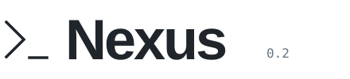

<picture>
  <source media="(prefers-color-scheme: dark)" srcset="docs/next/assets/nexus-wordmark-dark.svg">
  
</picture>

### Turn a task into code, right from your project terminal.

A lightweight coding agent that reads code, edits files, runs tests and shows its work.
One message-driven loop. No database or repository index required.

Python 3.12+ &nbsp; / &nbsp; Windows · Linux &nbsp; / &nbsp; [MIT](LICENSE)

**English** / [简体中文](README.zh-CN.md)　 · 　[Quick start](#quick-start)　 · 　[User guide](docs/next/usage-guide.md)

[PyPI · v0.2.0](https://pypi.org/project/nexus-coding-agent/0.2.0/)　 · 　[Release notes](https://github.com/K529529/Nexus/releases/tag/v0.2.0)

---

<a id="quick-start"></a>
## 01 / Quick start

You need Python 3.12+ and an account with an OpenAI-compatible model service that supports tool calling.
**Choose either installation method below.**

### Option 1: Install from PyPI (recommended)

Open a terminal in the project root you want Nexus to work on:

```sh
python -m pip install "nexus-coding-agent==0.2.0"
nexus
```

No Nexus checkout needed. Install once, then run `nexus` in any project using the same Python environment.
A virtual environment is recommended. If the command is not on your PATH, use `python -m nexus`.

### Option 2: Install from source

For developers who want to read or modify Nexus itself. Requires Git:

```sh
git clone https://github.com/K529529/Nexus.git
cd Nexus
python -m pip install -e .
```

Then **change to the project root you want Nexus to work on** and run:

```sh
nexus
```

The editable install (`-e`) picks up changes to Nexus's Python source without reinstalling.
Your launch directory is the workspace; Nexus also reads that directory's `AGENTS.md` for project guidance.

### First launch: connect your model

On first launch, `nexus` prompts for a model name, Base URL, context window and the **name of an API key environment variable**.
Settings are saved in `~/.nexus/config.toml` and shared across projects.

For example, keep the default variable name `NEXUS_MODEL_API_KEY`, save the settings, then set your real key in the same terminal and restart:

```powershell
# Windows PowerShell
$env:NEXUS_MODEL_API_KEY = "your API key"
nexus
```

```sh
# Linux
export NEXUS_MODEL_API_KEY="your API key"
nexus
```

Type your task at the `You ›` prompt:

```text
You › Reject whitespace-only titles, add a regression test and run the existing tests.
```

Put the key in the environment variable, not in chat. Your provider bills model API usage.
For manual configuration, MCP and model parameters, see the [user guide](docs/next/usage-guide.md#configure).

<a id="everyday-use"></a>
## 02 / Everyday use

| Task | Command |
| --- | --- |
| Work interactively | Run `nexus` in your project |
| Run one task | `nexus exec "Fix the bug and run tests"` |
| Show timing, tokens and tool statistics | `nexus --profile` |
| Pick a recent session | `nexus resume`, or `/resume` in chat |
| Start a new session | `/new` |
| Show available Skills and their status | `/skills` |
| Select / clear an explicit Skill | `/skill <name>` / `/skill off` |
| Help / exit | `/help` / `/exit` |

Skills live at `~/.nexus/skills/<name>/SKILL.md`; start with the [pytest regression example](docs/next/skills/pytest-regression/SKILL.md).
`/skill off` clears explicit selection while automatic loading remains available. Sessions are saved under `~/.nexus/sessions/`.
Resuming an unfinished task restores its context; an ordinary new task does not automatically inherit the previous task's full history.

<a id="capabilities-and-evidence"></a>
## 03 / Capabilities and evidence

- **Coding loop**: execute commands, apply patches, run checks and act on tool feedback.
- **Context management**: observation projection, safety compaction and structured Plan/Todo progress.
- **Extensible and inspectable**: local Skills, stdio MCP, session recovery, JSONL trajectories and run profiles.

Release validation: **498 tests passed** on each of Windows and Linux; 10 opt-in Docker checks were skipped in the offline suite.
One cost-first round of the fixed eight-case development set achieved **6/8 PASS and 8/8 autonomous completions**.
This is local acceptance evidence, not stable 8/8 or an official SWE-bench score.
See [results and limitations](docs/next/suite-hardening-evidence.md).

Commands run with your local user permissions, not in an OS sandbox. Review code changes and test results.
Upgrading from legacy `0.1.0`? Read the [migration notes](docs/next/release-0.2.0.md#install-and-migrate) first.

<a id="learn-more"></a>
## 04 / Learn more

[User guide](docs/next/usage-guide.md) · [Engineering walkthrough](docs/next/engineering-walkthrough.md) · [Development evaluation](evaluation/next-dev-v0/README.md) · [0.2.0 release record](docs/next/release-0.2.0.md)

<a id="license"></a>
## 05 / License

[MIT](LICENSE)
