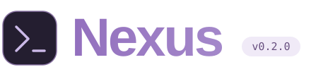

<p>
  
</p>

### 在你的项目目录里，用自然语言完成编程任务。

一个轻量的终端 Coding Agent：读取代码、修改文件、运行测试，并展示执行过程。
单个消息驱动循环，无需数据库或仓库索引。

Python 3.12+ &nbsp; / &nbsp; Windows · Linux &nbsp; / &nbsp; [MIT](LICENSE)

[English](README.md) / **简体中文** &nbsp; · &nbsp; [快速开始](#快速开始) &nbsp; · &nbsp; [使用手册](docs/next/usage-guide.zh-CN.md) &nbsp; · &nbsp; [PyPI](https://pypi.org/project/nexus-coding-agent/0.2.0/) &nbsp; · &nbsp; [发布记录](https://github.com/K529529/Nexus/releases/tag/v0.2.0)

---

<a id="快速开始"></a>
## 01 / 快速开始

准备 Python 3.12+，以及一个支持工具调用的 OpenAI-compatible 模型服务账号。
**下面两种方式任选一种。**

### 方式一：从 PyPI 安装（推荐）

在你希望 Nexus 处理的项目根目录打开终端，执行：

```sh
python -m pip install "nexus-coding-agent==0.2.0"
nexus
```

不需要克隆 Nexus 仓库。安装一次后，在同一个 Python 环境中，进入任意项目目录运行 `nexus` 即可。
建议使用虚拟环境；若终端找不到 `nexus`，可用 `python -m nexus` 启动。

### 方式二：从源码安装运行

适合想阅读或修改 Nexus 源码的开发者，需要 Git：

```sh
git clone https://github.com/K529529/Nexus.git
cd Nexus
python -m pip install -e .
```

安装完成后，**切换到你要处理的项目根目录**，再运行：

```sh
nexus
```

`-e` 是可编辑安装，修改 Nexus 的 Python 源码后无需重新安装。
运行 `nexus` 时所在的目录就是工作区；它也会读取该目录的 `AGENTS.md` 作为项目指引。

### 首次启动：配置模型

首次运行 `nexus` 会引导你填写模型名称、Base URL、上下文窗口，以及 **API key 的环境变量名**。
配置保存在 `~/.nexus/config.toml`，无需每个项目重复配置。

例如在引导中使用默认变量名 `NEXUS_MODEL_API_KEY`，保存后在同一终端设置真实 key 并重新启动：

```powershell
# Windows PowerShell
$env:NEXUS_MODEL_API_KEY = "你的 API key"
nexus
```

```sh
# Linux
export NEXUS_MODEL_API_KEY="你的 API key"
nexus
```

随后在 `You ›` 提示符后输入任务：

```text
You › 修复空白标题仍能提交的问题，补充回归测试并运行现有测试。
```

API key 填入环境变量，不填入聊天框。模型调用费用由服务商收取。
手动配置、MCP 和模型参数见[使用手册](docs/next/usage-guide.zh-CN.md#配置)。

<a id="日常使用"></a>
## 02 / 日常使用

| 你想做什么 | 操作 |
| --- | --- |
| 交互式工作 | 在项目目录运行 `nexus` |
| 执行一条任务 | `nexus exec "修复缺陷并运行测试"` |
| 查看耗时、token 与工具统计 | `nexus --profile` |
| 选择最近的会话 | `nexus resume`，或聊天中输入 `/resume` |
| 开始新会话 | `/new` |
| 查看可用 Skill 和启用状态 | `/skills` |
| 指定 / 取消指定 Skill | `/skill <名称>` / `/skill off` |
| 查看帮助 / 退出 | `/help` / `/exit` |

Skill 放在 `~/.nexus/skills/<名称>/SKILL.md`，可参考 [pytest 回归测试示例](docs/next/skills/pytest-regression/SKILL.md)。
`/skill off` 取消显式指定，仍允许模型按任务自动加载。会话保存在 `~/.nexus/sessions/`；
恢复未完成任务会续接其上下文，普通新任务不会自动带入前一任务的完整历史。

<a id="能力与验证"></a>
## 03 / 能力与验证

- **编码闭环**：执行命令、应用补丁、运行检查，并根据工具结果继续修复。
- **上下文管理**：工具结果投影、安全压缩，以及独立的 Plan/Todo 进度状态。
- **可扩展、可追溯**：本地 Skills、stdio MCP、会话恢复、JSONL 轨迹与执行统计。

发布验证：Windows / Linux 各 **498 项测试通过**，10 项 Docker 验收按需运行、未计入本次离线测试。
固定八例开发评测的一轮成本优先配置取得 **6/8 PASS、8/8 自主结束**；这是本地验收结果，
不代表稳定 8/8 或官方 SWE-bench 成绩。详见[评测结果与限制](docs/next/suite-hardening-evidence.md)。

Nexus 使用你的本机权限执行命令，不是操作系统沙箱；请审查代码改动与测试结果。
从旧 `0.1.0` 升级前，请先阅读[迁移说明](docs/next/release-0.2.0.md#install-and-migrate)。

<a id="深入了解"></a>
## 04 / 深入了解

[完整使用手册](docs/next/usage-guide.zh-CN.md) · [工程设计与代码导读](docs/next/engineering-walkthrough.md) · [开发评测指南](evaluation/next-dev-v0/README.md) · [0.2.0 发布记录](docs/next/release-0.2.0.md)

<a id="许可证"></a>
## 05 / 许可证

[MIT](LICENSE)
