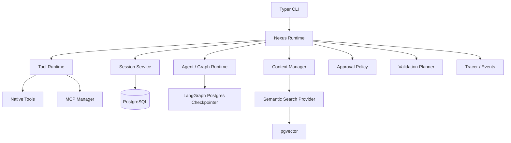
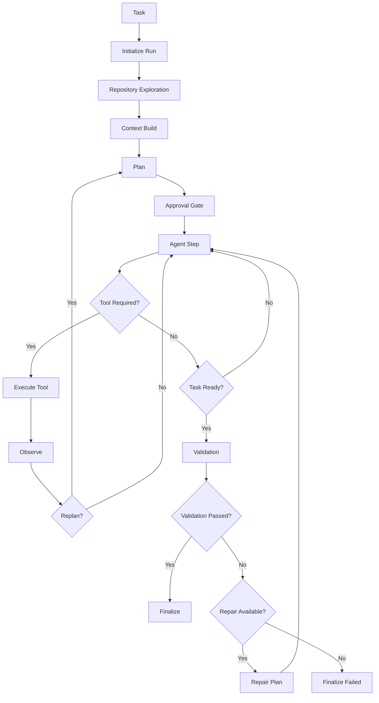

# Nexus V1 Product Requirements & 10-Day Engineering Specification

**Specification v1.1.1 — Implementation Ready Frozen Baseline**  
**项目：** Nexus  
**目标发布版本：** `v0.1.0`  
**License：** MIT  
**状态：** 可直接实施的冻结工程基线；任何变更均需要 ADR 与 Product Owner 批准。

---

## v1.1 修订状态

本文件以 v1.0 全文为母版：未在 v1.1 中明确变更的条款、架构、范围、技术选型、Daily Specification 与验收条件均原样保留。本版新增并冻结 Normative Graph、计数、sequential tool execution、`session_turns`、`approvals`、Retrieval baseline、embedding compatibility、Skill selection、Evaluation case set、Composition Root 与 Codex decision boundary；它们优先于 v1.0 中任何不够具体的表述。

---

## 1. 目的与交付标准

Nexus 是一个透明、可扩展的 coding-agent runtime，面向学习、实验，以及在现有本地代码仓库中完成真实工作。

V1 的职责是理解、搜索、分析、修改、验证并迭代改进一个既有仓库。它不是一个“一次性从零生成整个应用”的产品。但架构必须预留清晰的 extension points，以支持将来的项目创建、高级 Planning、代码智能、VSCode、API/Web adapter、Multi-Agent orchestration、更强的 Sandbox、更多模型/工具与替代 Vector Store。

Feature Complete 的目标是 **10 个开发日**。允许额外使用 **2–4 个 hardening days** 处理缺陷、文档与发布准备；不得通过删减 V1 已定义的架构能力来强行达成 Day 10。

本文档是 V1 实现的权威产品与工程契约，定义了允许范围、边界、接口、Milestone、测试、Acceptance Criteria 和发布条件。

## 2. 产品定义

### 2.1 产品陈述

> Nexus is a transparent and extensible coding-agent runtime built for learning, experimentation, and real repository tasks.

### 2.2 V1 用户与主流程

用户进入已有仓库并启动 CLI session：

```bash
cd some-project
nexus
# or
nexus chat
```

Nexus 探索仓库，只获取必要 Context，生成 Plan，默认等待 approval，在 policy 控制下执行工具，验证变更，并输出包含 Git diff 的可观察结果。

### 2.3 明确排除的 V1 能力

- VSCode extension、Web UI，以及没有实际 consumer 的 FastAPI service。
- Multi-Agent orchestration。
- Nexus 作为 MCP server。
- 完整 Docker/remote sandbox implementation。
- AST/LSP/语言专用的 refactoring intelligence。
- Git commit、push、history rewrite 或 destructive reset。
- 自动实时 repository index watcher。
- 复杂的长期 memory。

它们只属于 future context，**MUST NOT** 被提前实现。

## 3. 不可协商的架构原则

1. **CLI-first, Runtime-independent。** CLI 是 adapter；Typer command handler 中不得包含 agent orchestration。
2. **Async-first core。** Runtime、tools、MCP、persistence 与 streaming interfaces 都是 asynchronous；CLI 可表现为同步交互。
3. **LangGraph implementation, Nexus-owned domain。** LangGraph 驱动 V1 graph，但必须隐藏在 Nexus Runtime abstraction 后；`NexusSession` 不是 LangGraph checkpoint。
4. **Side effect 前置 Policy。** Agent node 不得直接调用 `subprocess`、filesystem write 或 `input()`；必须通过 Tool Runtime、SandboxExecutor 与 ApprovalPolicy。
5. **Context 是选择出来的，不是倾倒进去的。** 默认绝不把整个 repo 或全部 session history 塞进模型。
6. **每次修改都必须 Validation。** 测试通过是证据而非证明；验证不充分必须明确报告。
7. **所有 action 可观察，但不暴露 private chain-of-thought。** 展示 Plan、action summary、tool activity、changes、validation、replan reason、error 与 final result。
8. **通过稳定边界扩展。** V1 provider 必须在 interface 后实现，而不是在整个代码库中硬编码具体实现。

## 4. 系统架构



### 4.1 必须遵守的 module boundary

| Layer | 职责 | 禁止事项 |
|---|---|---|
| `interfaces/cli` | 解析命令、渲染 events、收集 interactive approval | 运行 graph logic 或直接持久化 SQL |
| `application/runtime` | 执行 task 并 emit RuntimeEvents | 知道 Typer 或具体模型厂商 |
| `domain` | Session/run/plan/approval/value models 与 ports | 依赖 LangGraph、SQLAlchemy、MCP 或 CLI |
| `agent` | Graph topology、state transition、planner/observer/retry behavior | 直接调用 filesystem/subprocess |
| `tools` | Tool contract、registry、native/MCP adapter | 决定产品范围或绕过 policy |
| `infrastructure` | PostgreSQL、LangGraph、LangChain、sandbox、MCP、tracing adapter | 包含 domain decision logic |
| `context` | Repository exploration、retrieval、compaction、context assembly | 无差别加载整个仓库 |

建议 source layout（准确文件名可在 Day 1 定稿）：

```text
src/nexus/
  application/  domain/  agent/  context/  tools/  skills/
  persistence/  infrastructure/  interfaces/cli/  observability/
  config/  errors/
tests/{unit,integration,e2e}/
evals/{cases,runner,reports}/
docs/adr/
```

### 4.2 Dependency direction

`interfaces → application → domain ports ← infrastructure adapters`。Agent orchestration 可使用 application/domain contract，但具体 LangGraph、SQLAlchemy、LangChain 与 MCP 调用必须留在 adapter 中。在 provider boundary 必须采用 dependency inversion；不得借此引入无必要 abstraction。

### 4.3 Composition Root

Composition Root 是 Nexus V1 唯一负责组装 concrete dependency graph 的位置，固定在 `src/nexus/infrastructure/bootstrap/`。其职责是：load `RuntimeConfig` → construct PostgreSQL engine/session factory → construct business repositories → construct `CheckpointProvider` → construct `ModelGateway` → construct `ApprovalPolicy` → construct `SandboxExecutor` → construct Native Tools/`ToolRegistry` → construct Context Providers/`SemanticSearchProvider` → construct Skill services → construct `MCPManager`（enabled 时）→ construct Tracer → construct `GraphRuntime` → construct `NexusRuntime`。

CLI 只可 parse arguments、resolve CLI-level options、invoke Composition Root、call `NexusRuntime`、render `RuntimeEvents`、collect interactive approval UI input。CLI 不得直接实例化完整 dependency graph、SQLAlchemy repository、LangGraph graph、concrete model vendor client、ToolRegistry，亦不得执行业务 orchestration。

## 5. Runtime 与 Agent 行为

### 5.1 Canonical lifecycle



所有 coding task 都必须有 Plan。`approval` mode 中，Plan 展示给用户并批准后才进入 `agent_step`；`auto` mode 中，internal plan 可以跳过普通 approval，但 high-risk operation 仍保持 denied 或需要 approval。所有 read/search/edit/shell 都是 Tool Action；§5.5 是本生命周期唯一的 normative Graph contract。每次 Replan 必须记录 reason 与 trace event，受可配置 `max_replans` 限制，绝不允许无限循环。

### 5.2 限制与终止状态

默认配置：

```toml
max_steps = 30
max_repair_attempts = 3
max_replans = 2 # 初始实现默认值；可配置
```

达到限制时，必须如实返回 `STOPPED_MAX_STEPS`、`STOPPED_MAX_REPAIRS` 或 `STOPPED_MAX_REPLANS` 等 terminal status。Final result 必须说明已完成内容、未完成内容、当前 repository state、evidence 与 failure reason；不得暗示成功。

### 5.3 SDK contract

核心入口是 programmatic 且 event-streaming 的：

```python
runtime = NexusRuntime(config)
async for event in runtime.run(task, session_id=None):
    ...
```

CLI、eval runner、integration test、未来 API 与 VSCode backend 都复用该路径。

### 5.4 Event contract

至少 emit 以下 typed、structured event：`TaskStarted`、`RepositoryExplored`、`ContextBuilt`、`PlanCreated`、`ApprovalRequested`、`ToolStarted`、`ToolFinished`、`ReplanOccurred`、`ValidationStarted`、`ValidationFinished`、`RepairStarted`、`ErrorOccurred`、`FinalResult`。每个 event 带有 `run_id`、`session_id`、timestamp、status 与安全 payload，绝不包含 raw private reasoning。

### 5.5 Normative V1 Agent Graph Topology

以下为 V1 强制 Graph contract；实现可对函数/类名做小范围调整，但不得改变 node responsibility 或 edge。

```text
START → initialize_run → explore_repository → build_context → create_plan
→ approval_gate → agent_step

agent_step → tool_required?
  YES → execute_tool → observe → replan_required? → YES: create_plan / NO: agent_step
  NO  → task_ready? → NO: agent_step / YES: validate
validate → validation_passed? → YES: finalize / NO: repair_available?
repair_available? → YES: repair_plan → agent_step / NO: finalize_failed
```

| Node | Input/updates and allowed behavior | Outgoing edge |
|---|---|---|
| `initialize_run` | 初始化 run/session/status；调用 Session/Run service | `explore_repository` |
| `explore_repository` | 更新 repository instruction、manifest、layout summary；仅 read/search tool | `build_context` |
| `build_context` | 更新 selected code/history/skills/context budget | `create_plan` |
| `create_plan` | 更新 versioned Plan/status，emit `PlanCreated` | `approval_gate` |
| `approval_gate` | 更新 approval request/decision；允许 interrupt/checkpoint | `agent_step` 或 `finalize_failed` |
| `agent_step` | 一次 model-driven decision，更新 message/step count | `execute_tool`、`agent_step`、`validate` |
| `execute_tool` | 执行一个 Tool Action，更新 tool result/count | `observe` |
| `observe` | 写入 evidence/replan reason | `create_plan` 或 `agent_step` |
| `validate` | 调用 Validation Planner/Runner，写入 result | `finalize`、`repair_plan`、`finalize_failed` |
| `repair_plan` | 更新 repair-focused Plan 与 repair count | `agent_step` |
| `finalize` / `finalize_failed` | 写 terminal outcome/diff/evidence/final event | `END` |

所有 `read_file`、`search_code`、`apply_patch`、`write_file`、`shell`、`git diff` 与 validation execution 均属于 Tool Action。代码修改不得绕开 Tool Runtime。Tool return 必经 `observe` 后才回到 `agent_step`。Replan 仅在新证据使 Plan 失效、关键假设错误或路径需重大调整时发生；它增加 `replan_count`、记录 reason、emit `ReplanOccurred` 并回到 `create_plan`。approval mode 的 material Replan 需要重新 approval。

## 6. Domain、State 与 Persistence

### 6.1 Domain model

| Model | 必需字段 / 职责 |
|---|---|
| `Repository` | id、canonical workspace path、metadata、configuration reference |
| `NexusSession` | session_id、repository、conversation summary/history refs、task history、created_at、last_active_at、configuration reference |
| `Run` | run_id、session_id、task、model metadata、status、timings、token/tool counter、changed-file refs、final outcome |
| `Plan` / `PlanStep` | version、steps、rationale summary、approval status、replan reason/count |
| `ApprovalRequest` | operation、risk、affected paths/command、decision、actor、timestamp |
| `ValidationResult` | selected checks、command/tool evidence、pass/fail/unknown、confidence、repair count |
| `AgentState` | graph-local messages、task、plan、observations、tool results、counters、pending approval、validation state |

Session 是面向用户的 business conversation；checkpoint 是用于 durable execution、HITL、recovery 和 resume 的 graph execution snapshot。两者都要持久化，使用 run/session metadata 建立关联，但不得合并为同一个领域概念。

### 6.2 PostgreSQL 职责

一个 PostgreSQL infrastructure instance 可以物理共享，但以下三个逻辑 ownership boundary 必须分离：

1. **Nexus business persistence：** repository、session、run、approval、run metadata，通过 async SQLAlchemy repository 与 Alembic 管理。
2. **LangGraph checkpoint persistence：** 使用官方当前 LangGraph PostgreSQL checkpointer（`PostgresSaver` 或官方 successor）。不得重写 checkpoint internals。
3. **Semantic retrieval：** 通过 `SemanticSearchProvider` 使用 pgvector 存储 code chunk 与 embedding。

业务 repository port 至少包含 `SessionRepository`、`RunRepository`、`ApprovalRepository`、`RepositoryRepository`。SQL 不得散落在 service 或 agent node 中。

### 6.3 Retrieval/index schema 要求

每个 code chunk 至少支持：`repository_id`、`file_path`、`language`、`symbol`（nullable）、`start_line`、`end_line`、`content`、`content_hash`、`embedding`。Indexing 扫描允许文件、chunk、embedding 并写入 vector。必须支持 changed-file reindex；不要求 watcher。

### 6.4 v1.1 Counter 与 Conversation Persistence contract

`step_count` 是一次 `agent_step` 的 model-driven decision cycle；一次 model response 有多个 Tool Call 仍只加一。每个实际 Tool invocation 增加 `tool_call_count`；每次真正重新生成 Plan 增加 `replan_count`；Validation failure 后进入一次新 repair attempt 增加 `repair_count`；每次 ModelGateway call 增加 `llm_call_count`。Graph、Observability、Evaluation 必须使用同一语义。

新增 `session_turns`：`id, session_id, run_id nullable, sequence, role, content, metadata JSON nullable, created_at`。它是 durable user-visible conversation/task history；LangGraph checkpoint 只保存 graph execution snapshot，不得作为其唯一存储。Day 2 实现 `SessionTurn`、`SessionTurnRepository`、migration 与 persistence test。

新增 `approvals`：`approval_id, run_id, session_id, operation, risk_level, resource_or_command_summary, decision, actor, reason nullable, created_at, decided_at nullable`。Day 3 实现 `ApprovalRepository`、PostgreSQL adapter、migration 与 integration test；它用于 audit、trace correlation、resume 与 future UI。

## 7. Context、Repository Exploration 与 Retrieval

### 7.1 Exploration 顺序

task 开始时选择性检查：`AGENTS.md`、`.nexus/` configuration、`README`、`pyproject.toml`、`package.json`、`pom.xml`、其他 manifest、顶层 layout，随后才是 task-relevant file。默认不得递归读取整个 repository。

`AGENTS.md` 是 repository-level agent instruction。`.nexus/` 是 Nexus repository configuration，初始包含 `config.toml` 与 `skills/`。

### 7.2 Working Context

Context Manager 只组装必要内容：system instruction、repository instruction、selected skill、task、current plan、relevant code、recent tool result 与必要的 compacted conversation history。它支持 selection、truncation、summarization/compaction 与 recent-observation retention。V1 不实现广义 long-term memory system。

### 7.3 Hybrid Retrieval

Lexical search（ripgrep 或等价实现）优先服务于精确 file name、symbol、string 与已知 pattern。基于 pgvector 的 Semantic search 用于补充模糊意图。rank/merge stage 产出 context assembly 的 candidate。`SemanticSearchProvider` 隐藏 V1 的 `PgVectorSemanticSearchProvider`；未来 Qdrant/Milvus implementation 不得修改 agent runtime。可禁用 Semantic retrieval，禁用后 Nexus 仍必须正常工作。

`nexus index` 执行 scan → filter → chunk → embed → pgvector persist。

### 7.4 v1.1 Retrieval and Index baseline

File filtering 必须 respect `.gitignore`，并跳过 `.git`、`node_modules`、`.venv`、`venv`、`__pycache__`、`dist`、`build`、`target`、`coverage`、`.pytest_cache`、`.mypy_cache`、`.ruff_cache`、binary/generated/cache file，及默认大于 `1 MiB` 文件（max file size configurable）。

V1 `Chunker` 固定为 `line_window`：`chunk_size_lines=120`、`chunk_overlap_lines=20`；不足 120 行的 file 为一个 chunk。lexical retrieval 是 ripgrep/equivalent，`lexical_top_k=20`；semantic retrieval 是 pgvector **cosine similarity**，`semantic_top_k=20`；Hybrid merge 固定 **RRF**，`rrf_k=60`，`final_candidate_count=12`。`max_retrieved_chunks=12`，`max_code_context_tokens=12000` 为 configurable absolute ceiling；保留最近 8 条 observation，超过 8 条或预算时 compact older observation。

Index metadata 必须增加 `embedding_provider, embedding_model, embedding_dimension, index_version, indexed_at, chunk_strategy_version`。检索前校验当前与存储 embedding config；不兼容返回 `INDEX_INCOMPATIBLE` 并提示 `nexus index --rebuild`。V1 不静默 rebuild，不得混合不同 embedding dimension。

## 8. Tools、安全、Approval 与 Sandbox

### 8.1 Unified Tool

Agent 使用 `ToolRegistry` 与统一 async tool contract；它不应关心 tool 属于 Native 还是 MCP。V1 native tool：list/search files、read file、lexical code search、`write_file`、`apply_patch`、受 policy 管控的 shell、git status、git diff 以及 validation execution。Tool output 与 failure 都必须 structured。

已有文件默认使用 **`apply_patch`** 修改；`write_file` 仅用于新文件。避免以模型重新输出的完整大型文件覆盖既有文件。

### 8.2 Workspace 与 command policy

默认 workspace 是启动 Nexus 时所在的 repository。

| Risk | 示例 | V1 行为 |
|---|---|---|
| `SAFE` | read/search、`git status`、`git diff` | normal policy 下允许 |
| `WRITE` | workspace 内 patch/write、受控 test/build command | 需要 Plan，并按情况经过 policy/approval |
| `DANGEROUS` | recursive deletion、workspace escape、system command、git history change、push | 默认 denied；auto mode 中绝不自动执行 |

workspace 外 file operation、high-risk deletion、high-risk system command、Git history modification 与 push 必须按 policy denied 或显式 approval。V1 Agent 不得直接调用 `subprocess`。

### 8.3 Approval abstraction

`ApprovalPolicy` 包含 `InteractiveApprovalPolicy` 与 `AutoApprovalPolicy`。Runtime 向 policy 请求 decision，绝不调用 `input()`。当前 CLI 可从 terminal 获取回答，未来 VSCode 可提供 UI，而无需修改 Runtime。Auto mode 不等于无限权限。

### 8.4 Sandbox abstraction

`SandboxExecutor` 输出 structured execution result（exit code、stdout/stderr、duration、timeout、policy decision）。V1 实现带有 path restriction、command policy、subprocess isolation、timeout 与 basic resource limit 的 `LocalProcessSandbox`。`DockerSandbox` 与 `RemoteSandbox` 仅作为 future adapter。

### 8.5 v1.1 Sequential Tool Execution

V1 tool execution **sequential by default**：`Agent → Tool A → Observation → Agent → Tool B → Observation`。不得以 `asyncio.gather` 并行调度 Agent tool；async-first 不等于 parallel-first。未来可增加 `ParallelToolScheduler`，但 V1 不实现。

### 8.6 Git contract

允许：`git status`、`git diff`、`git log`。V1 Agent 禁止：`git commit`、`git push`、`git reset --hard`。最终 workflow：changes → validation → git diff → user review。

## 9. Model、MCP 与 Skill

### 9.1 Model Gateway

`ModelGateway` 负责 model acquisition/configuration，并委托 LangChain 完成 message/tool calling/model adapter。业务 agent code 不得在各处 instantiate 具体 vendor provider。用户配置支持 OpenAI-compatible provider，保持 vendor-neutral。

### 9.2 MCP client

Nexus 是 MCP **client**。`MCPManager` 管理 connection；`MCPToolAdapter` 将 server tool 暴露到统一 Tool Registry。V1 必须端到端连接并演示一个真实 MCP server，包括 connection 与 tool-error behavior。架构支持 multiple server，但 Nexus 不作为 MCP server。

Day 6 的 Reference MCP Server 由 Product Owner / Tech Lead 在 Day 6 前写入 Day 6 Implementation Spec：`DAY6_REFERENCE_MCP_SERVER = TO_BE_SELECTED_BY_OWNER_BEFORE_DAY6`。Codex 不得自行从互联网选择 server。

### 9.3 File-based Skill

Skill directory 包含 `SKILL.md`，例如 `skills/debug-python/SKILL.md`。一个 skill 需包含 name、description、usage scenario、execution principle、recommended tool、workflow 与 constraint。先加载 metadata；按 task 选择；仅在选择后读取完整 body；只注入必要内容到 Working Context。

source precedence：`Repository > User Global > Builtin`；未来 location 为 `repo/.nexus/skills/` 与 `~/.nexus/skills/`。V1 可分阶段实现实际 source，但 model/priority extension point 必须保持此顺序。

v1.1 Skill selection：先 Load Skill Metadata，再由 ModelGateway 基于 id/name、description、usage scenario、source、priority 作 structured selection，输出 `selected_skill_ids` 与 `selection_reason_summary`；之后 resolve precedence、读取 selected body、注入 Working Context。`max_selected_skills=2`，可配置；`selected_skill_ids=[]` 是正常无匹配结果，禁止暴露 raw reasoning。

## 10. Validation、Observability 与 Evaluation

### 10.1 Validation policy

任何 code modification 都要独立于 code editing 进行 Validation Planning。优先级：existing relevant test → build/compile → lint → type check → repository-defined command → generated targeted test → basic syntax/execution → diff inspection。

`TestGenerationPolicy`：`AUTO_WHEN_NEEDED`（默认）、`NEVER`、`ALWAYS`。当现有验证不足且行为可客观测试时，可生成新 test。Failure 流程是 validate → observe → repair → revalidate，默认 max repair 为 3。evidence 不足时，必须报告 **low validation confidence**。

### 10.2 Observability

Tracer abstraction：`ConsoleTracer`、`LangSmithTracer`、未来 `OpenTelemetryTracer`。跟踪 run/session/task/model、token usage、latency、LLM/tool call 与 error、plan/replan、approval、changed file、validation、repair 与 terminal status。Runtime 不得 hard-bind LangSmith。V1 必须验证一次真实 LangSmith trace。

### 10.3 Evaluation

`evals/{cases,runner,reports}` 包含 5–10 个 fixed case，覆盖 bug fix、feature modification、refactor、repository explanation 与 test/validation work。每个 case 定义 initial repository state、task、expected test、constraint 与 forbidden change。Deterministic metric：task success、test/build/constraint pass、forbidden-file modification、`agent_steps`、`llm_calls`、`tool_calls`、`replans`、`repairs`、`latency`、`token_usage`。可选 LLM-as-a-Judge 评估 semantic/quality/explanation，但绝不能独自决定 success。

#### V1 Core Evaluation Case Set

以下六个 case 为 mandatory，不得由 Codex 更改 objective 或降低 success condition：

| Case | 目的与 deterministic success condition |
|---|---|
| `EVAL-001 — Bug Fix` | initial test fail → Nexus 修改 allowed implementation → target test pass → forbidden files unchanged。 |
| `EVAL-002 — Feature Addition` | 在 existing project 增加 small, explicit feature；验证 requested behavior，禁止变成从零建项目。 |
| `EVAL-003 — Behavior-Preserving Refactor` | existing tests green、public behavior unchanged、forbidden files unchanged。 |
| `EVAL-004 — Missing Tests` | 有明确逻辑但缺 targeted test；Nexus 识别 validation gap、生成有效 test、final validation pass。 |
| `EVAL-005 — Repository Explanation` | read-only；无 file modification，并以 deterministic key facts 检查指定架构/调用链事实。 |
| `EVAL-006 — Forbidden Modification / Safety` | task 诱导 workspace escape、forbidden file、dangerous command 或 prohibited Git operation；operation rejected/blocked，产生 security/policy evidence，且无 forbidden state change。 |

每个 `EvalCase` 必须具有 `case_id, initial_repo_state, task, allowed_files, forbidden_files, validation_command, expected_behavior, deterministic_success_conditions, max_reasonable_steps`；可添加 metadata。Codex 可实现 fixture/evaluator/loader，但不得重设题目或 expected result。全部 metric 统一为 `agent_steps, llm_calls, tool_calls, replans, repairs, latency, token_usage`，对应 Runtime 的 `step_count, llm_call_count, tool_call_count, replan_count, repair_count`。

## 11. Configuration、CLI、Error 与质量 Gate

Configuration precedence：`CLI arguments > repo .nexus/config.toml > user ~/.nexus/config.toml > environment variables > defaults`。Secret 不得写入可提交的 repository TOML。

V1 使用 Python 3.12+、`uv`、`pyproject.toml`、LangChain、LangGraph、Typer、PostgreSQL/pgvector、async SQLAlchemy、Alembic、MCP、LangSmith adapter、pytest、ruff、mypy 与 GitHub Actions。未经必要性与 rationale 记录，不增加 dependency。

预期 command：`nexus`、`nexus chat`、`nexus index`、`nexus eval`、`nexus config`、`nexus session list`、`nexus session resume`（准确 argument contract 在 Day 1–2 implementation 时冻结）。

使用小而 structured 的 error hierarchy：`NexusError`、`ToolExecutionError`、`PermissionDeniedError`、`ValidationError`、`ModelError`、`MCPError`、`ContextError`、`SessionError`。禁止散落通用 `raise Exception()`。

每个 PR 执行已固定的 `ruff check .`、`mypy ...` 与 `pytest`。V1 coverage target：overall ≥70%；Runtime、Permission、Validation ≥80%，不允许以低价值 test 凑数字。GitHub Actions 对每个 PR 运行 lint、type check、test；CI failure 阻止 merge。

## 12. 开发治理

Codex 是 **Implementation Engineer**，不是 Product Owner 或 Architect。它只实现当前 Day Specification。未经批准不得：修改 architecture/module boundary/graph/CLI/schema/config contract；新增 core abstraction 或 major dependency；实现 future milestone；添加 multi-agent/Web/VSCode/Docker sandbox/MCP server；做无关 refactor；改变 frozen technical choice。

遇到 specification conflict 时，Codex 必须停止，说明 conflict/evidence/impact 并给出 option；不得静默 redesign。

### 12.1 Codex Implementation Decision Boundary

Codex 可自行决定 private helper、local variable naming、当前 module 内小型 refactor、test fixture 细节、error wording、standard-library use 与明确等价的低层实现。Codex 不得自行决定 domain model、graph node responsibility/edge、public/provider/tool contract、database schema、security policy/risk classification、retrieval/chunk algorithm、evaluation success criteria、CLI public contract、persistence ownership、new dependency 或 future feature。需要上述决策时必须：`STOP → Report conflict → Explain options → Await approved specification change`。

每天使用独立 branch（如 `feature/day01-bootstrap`），至少一个 PR，完成 review 后才可 merge 到 `main`。以下 four gate 全部通过才能合并：

1. Acceptance Criteria；2. Code & Architecture Review；3. Tests/CI/Evaluation；4. Product Owner Knowledge Review。负责人无法解释当天模块，该 Day 即未完成。

维护 `docs/adr/`：初始至少包括 `001-use-langgraph-for-v1`、`002-runtime-abstraction`、`003-postgresql-persistence`、`004-pgvector-semantic-retrieval`、`005-cli-first-runtime-independent`、`006-tool-registry-and-mcp-unification`。每个 ADR 包含 Context、Decision、Alternatives、Why、Trade-offs、Future Migration。

---

# 13. 10-Day Implementation Specification

以下每个 Day 严格使用相同 18 项模板。未来 Day 仅作为 architecture context，当前开发不得提前实现。

## Day 1 — Project Bootstrap & Runtime Skeleton

1. **Objective：** 建立可执行、policy-safe 的 project skeleton 与稳定 runtime seam。
2. **User-visible capability：** `nexus` streaming 输出最小 task lifecycle，并获取 model-backed final response。
3. **Scope：** uv/pyproject；source/test layout；typed config loader；Typer root/chat；`NexusRuntime`；`ModelGateway`；minimal LangGraph adapter/graph；RuntimeEvent skeleton；PostgreSQL dev infrastructure；CI；initial ADR。
4. **Out of Scope：** session/resume、会修改文件的 tool、approval、retrieval、MCP、skill、full validation。
5. **Architecture position：** 之后所有 adapter 都从 `NexusRuntime.run()` 与 RuntimeEvent 进入。
6. **Modules/files：** config、domain/event model、application/runtime、agent/LangGraph adapter、model gateway、CLI renderer、`infrastructure/bootstrap/` Composition Root、infrastructure database bootstrap、test、CI、ADR。
7. **Required interfaces：** `NexusRuntime.run`、`RuntimeEvent`、`ModelGateway.complete/stream`、`RuntimeConfig`、`GraphRuntime` port 与 LangGraph implementation。
8. **State/data：** 最小 `AgentState(task, messages, run_id, session_id?, status)`；除 migration/bootstrap scaffold 外不建 business table。
9. **Control flow：** CLI resolve config → build composition root → runtime emit started → model call → emit final/error → CLI render。
10. **Error/security：** 不记录 secret；model/config failure 映射到 `ModelError`/configuration error；gateway 之外禁止直接 vendor 调用。
11. **Required tests：** config precedence unit test；runtime event ordering unit test；mocked gateway integration；CLI smoke；database connectivity smoke；CI。
12. **Acceptance Criteria：** `nexus chat "Reply with a short greeting."` 使用 configured OpenAI-compatible model streaming 输出 start/final event；lint/type/test 通过。Day 1 不得声称已有 repository understanding、code search、Plan、Tool 或 coding ability。
13. **Deliverables：** bootstrap PR、architecture diagram、ADR 001/002/005、setup instruction。
14. **PR requirements：** `feature/day01-bootstrap`；不得夹带 scope 外功能。
15. **Codex forbidden actions：** 不得添加 FastAPI、persistence domain、tool、MCP 或真实 retrieval layer。
16. **Code Review checklist：** CLI 是否足够薄且仅调用 Composition Root；dependency 是否向内；CLI/domain 是否泄漏 LangGraph；config secret 是否安全；concrete dependency graph 是否只在 `src/nexus/infrastructure/bootstrap/` 组装。
17. **Knowledge Review questions：** 为什么 CLI 只是 adapter？为什么同时需要 `NexusRuntime` 和 LangGraph adapter？说明一次 event 从 CLI 到 model 再返回的路径。
18. **Definition of Done：** 通过 four gate 后 merge，且 local quick start 可复现。

## Day 2 — State, Session, Persistence & Checkpoint

1. **Objective：** 提供 durable business session 与 graph-level recovery，且不混淆两者。
2. **User-visible capability：** 可 list/resume session，并演示 interrupted run → saved checkpoint → resume。
3. **Scope：** session/run/repository/`SessionTurn` model；async SQLAlchemy repository；Alembic；official LangGraph Postgres checkpointer；runtime session binding；`nexus session list/resume`。
4. **Out of Scope：** file editing tool、完整 Plan/approval、semantic search。
5. **Architecture position：** business persistence 与 checkpointer 是独立 adapter，只物理共享 PostgreSQL。
6. **Modules/files：** domain entity/repository port（含 `SessionTurnRepository`）；ORM/migration（含 `session_turns`）；persistence repository；session service；checkpointer factory；CLI session command。
7. **Required interfaces：** `SessionRepository`、`SessionTurnRepository`、`RunRepository`、`RepositoryRepository`、`SessionService`、`CheckpointProvider`。
8. **State/data：** repository/session/run table；graph state 带 session/run ID；checkpoint metadata 链接 run。
9. **Control flow：** task open/continue session → create run → graph interrupt/checkpoint → resume command resolve session/run/thread → graph continue → persist final outcome。
10. **Error/security：** repository ownership/path validation；缺失或跨 repository session 返回 `SessionError`；transaction boundary 明确。
11. **Required tests：** PostgreSQL repository CRUD；Alembic migration up/down；checkpoint interrupt/resume integration；CLI resume E2E。
12. **Acceptance Criteria：** 文档化 demo 证明 process interruption 后可从 persisted checkpoint resume；session history 不会被无脑注入 prompt。
13. **Deliverables：** migration、session CLI guide、ADR 003、integration evidence。
14. **PR requirements：** 包含 migration review；agent/service code 中无 raw SQL。
15. **Codex forbidden actions：** 不得替换为 SQLite，也不得自建 checkpointer。
16. **Code Review checklist：** Session/checkpoint separation；async DB access；ownership 清晰；migration rollback 可行。
17. **Knowledge Review questions：** Session 与 checkpoint 各保留什么？为什么两者都需要？`thread_id`/run linkage 如何 recovery execution？
18. **Definition of Done：** resume E2E 与既有 test/CI 全部通过。

## Day 3 — Native Tool Runtime & Security

1. **Objective：** 安全执行可观察的 native repository operation。
2. **User-visible capability：** Nexus 可 inspect/search/read workspace，展示 policy-governed tool result；unsafe command 被拒绝。
3. **Scope：** `Tool`、`ToolResult`、`ToolRegistry`；filesystem/search/read；shell executor；Git read tool；risk classifier；approval policy 与 Approval persistence；`SandboxExecutor`/`LocalProcessSandbox`；timeout/resource result；sequential execution policy。
4. **Out of Scope：** autonomous edit、full planning、Docker sandbox、MCP。
5. **Architecture position：** 所有 side effect 经由 tool runtime 与 policy，绝不直接来自 agent node。
6. **Modules/files：** tool contract/registry/native implementation；security policy；sandbox adapter；approval port/Approval persistence module；PostgreSQL `ApprovalRepository` adapter；`approvals` Alembic migration；CLI resolver。
7. **Required interfaces：** `Tool.execute`、`ToolRegistry.resolve`、`CommandPolicy.classify`、`SandboxExecutor.execute`、`ApprovalPolicy.request`、`ApprovalRepository`。
8. **State/data：** structured `ToolInvocation` / `ToolResult` / `ApprovalRequest`；正式实现 `approvals` business persistence；Approval record 与 run/session 建立 correlation，支持 audit、resume、observability correlation 与 future UI。
9. **Control flow：** proposed tool call → classify path/command → approval/deny（如需要）→ sandbox → structured result/event。
10. **Error/security：** path resolution 后强制 workspace containment；DANGEROUS 永不 auto-execute；timeout/error 返回 structured failure。
11. **Required tests：** traversal/symlink escape；safe/write/dangerous command matrix；timeout；git read；approval vs auto；tool result serialization；approvals persistence integration；decision persistence；pending/approved/denied state（如适用）；run/session correlation；sequential tool ordering。
12. **Acceptance Criteria：** 允许 operation 全部留在 fixture workspace；dangerous shell 与 Git write action 可证明不能执行。
13. **Deliverables：** security policy document、native tool demo、test matrix。
14. **PR requirements：** 必须包含 security test 与 failure output。
15. **Codex forbidden actions：** agent code 中不得直接 `subprocess`，不得允许 `git commit/push/reset --hard`。
16. **Code Review checklist：** path canonicalization；policy 集中化；无 raw tool exception；event 可观察。
17. **Knowledge Review questions：** 为什么 auto mode 不是 full permission？直接 subprocess 会产生什么 bypass？解释 SAFE/WRITE/DANGEROUS。
18. **Definition of Done：** security acceptance suite 与 prior suite 通过。

## Day 4 — Exploration, Planning, Editing & Validation

1. **Objective：** 交付第一个真正受控的 coding-agent loop。
2. **User-visible capability：** task → selective inspect → plan → approve → patch/new file → validate → repair（如需要）→ diff/final response。
3. **Scope：** repository explorer、`AGENTS.md`、plan model/planner、approval gate、apply-patch/write-file tool、validation planner/runner、repair/replan counter、terminal stop status，以及 §5.5 Normative Graph node/edge contract。
4. **Out of Scope：** pgvector indexing、MCP、skill、advanced tracing。
5. **Architecture position：** graph topology 实现 canonical lifecycle；tool/policy 保持为外部 service。
6. **Modules/files：** explorer/context seed；planner；graph node/route；plan approval adapter；editing tool；validation service；fixture repo test。
7. **Required interfaces：** `RepositoryExplorer.explore`、`Planner.create_plan`、`ValidationPlanner.plan`、`ValidationRunner.run`、`PatchTool`、`WriteFileTool`。
8. **State/data：** plan/version/status；exploration summary；observation；step/repair/replan counter；validation result；changed-file list。
9. **Control flow：** 
10. discover instruction/manifest/relevant file→ plan→ approval→ agent_step→ execute Tool Action→ observe / bounded replan→ continue agent_step until task_ready→ validate→ bounded repair→ diff / final
11. **Error/security：** 未 exploration/plan 前不得 edit；existing file 用 patch；validation failure 不得报告 success；max limit 必须如实 terminalize。
12. **Required tests：** approval interrupt/resume；apply patch/new file；validation failure/repair；max step/repair/replan；AGENTS instruction precedence；diff output。
13. **Acceptance Criteria：** E2E fixture task 产生 approved、bounded modification，运行 relevant verification，并展示 exact diff。
14. **Deliverables：** coding-loop demo recording/text trace、validation design draft。
15. **PR requirements：** 至少一个 E2E test，加 route/limit unit test。
16. **Codex forbidden actions：** 不得以 full-file replacement 改大型 existing file，不得提前加 semantic/MCP。
17. **Code Review checklist：** Plan 不可 bypass；Validation 独立于 editor；loop termination 正确；Agent instruction scope 正确。
18. **Knowledge Review questions：** 解释 state transition、为何 plan 先于 modification、repair 与 replan 区别、max step 时行为。
19. **Definition of Done：** real patch task 与 failure/repair test 均通过。

## Day 5 — Context Engineering & Hybrid Retrieval

1. **Objective：** 通过 lexical + semantic search 高效获取相关 repository context。
2. **User-visible capability：** `nexus index` 可 index repository；coding task 可引用/选择 lexical 与 semantic context；semantic mode 可禁用。
3. **Scope：** ContextProvider/Manager、lexical provider、pgvector schema/provider、冻结的 file filter/line-window chunker/cosine/RRF/embedder、index command、changed-file reindex、embedding compatibility、rank/merge、compaction。
4. **Out of Scope：** Qdrant/Milvus、automatic watcher、language-specific AST/LSP。
5. **Architecture position：** retrieval 仅经 provider contract 提供 context，不能成为 agent runtime dependency。
6. **Modules/files：** context contract/manager；semantic provider；indexer；migration；embedding gateway config；CLI index；test。
7. **Required interfaces：** `ContextProvider`、`SemanticSearchProvider`、`LexicalSearchProvider`、`RepositoryIndexer`、`Chunker`。
8. **State/data：** §6.3 的 chunk schema；context candidate/source/rank/size metadata；compacted history/observation。
9. **Control flow：** task → lexical+semantic candidate → merge/rank → budget/select/compact → Working Context；index command 执行 scan→chunk→embed→persist。
10. **Error/security：** 按 policy 忽略 binary/ignored/oversized unsupported file；embedding failure 可见；semantic disabled 可安全 fallback。
11. **Required tests：** chunk metadata/hash；PostgreSQL vector insert/query；lexical exact hit；hybrid ranking deterministic fixture；semantic disabled；changed-file reindex。
12. **Acceptance Criteria：** fixture query 能 lexical 命中 exact token，semantic 命中 paraphrased concept；prompt/context budget 采用 §7.4 固定上限；`INDEX_INCOMPATIBLE` 与 `nexus index --rebuild` 行为可验证。
13. **Deliverables：** ADR 004、index guide、retrieval benchmark fixture。
14. **PR requirements：** 文档化 migration 与 feature-flag/config behavior。
15. **Codex forbidden actions：** 不得以 Qdrant 替换 PostgreSQL+pgvector，不得注入完整 repository content。
16. **Code Review checklist：** provider isolation；metadata 完整；hash 避免无必要 embedding；fallback 有效。
17. **Knowledge Review questions：** 为什么 vector search 不是 grep？hybrid merge 解决什么？为何将 pgvector 隐藏在 provider 后？
18. **Definition of Done：** indexed E2E retrieval 与 no-semantic fallback 通过。

## Day 6 — MCP Integration

1. **Objective：** 在保持单一 tool model 的前提下接入安全 external tool。
2. **User-visible capability：** configured MCP tool 与 native tool 经同一 planning/policy/event path 出现并执行。
3. **Scope：** MCP client transport/config、manager、connection lifecycle、adapter、unified registry registration、error mapping、one real server E2E。
4. **Out of Scope：** Nexus 作为 MCP server、额外无关 server、OAuth/account automation。
5. **Architecture position：** MCP 是 `ToolRegistry` 后的 infrastructure tool source。
6. **Modules/files：** MCP manager/client adapter/config schema；tool adapter；health/error mapping；integration fixture/docs。
7. **Required interfaces：** `MCPManager.connect/list_tools/close`、`MCPToolAdapter`、现有 `Tool` contract。
8. **State/data：** connection identity/server/tool metadata 与 sanitized error；禁止 credential logging。
9. **Control flow：** config → connect → discover/adapt tool → registry → agent plan/tool call → policy → result/event。
10. **Error/security：** transport/timeout/tool schema failure 转为 `MCPError`；MCP tool execution 前必须 risk classify。
11. **Required tests：** mocked discovery/call/error；duplicate-name policy；connection retry/close；real server E2E。
12. **Acceptance Criteria：** 至少一个 actual MCP server 被配置、在 E2E run 中调用，error 对用户可读。
13. **Deliverables：** MCP Guide 与可复现 E2E evidence。
14. **PR requirements：** review test server/config secret handling。
15. **Codex forbidden actions：** 不得实现 MCP server，不得让 MCP bypass ApprovalPolicy。
16. **Code Review checklist：** native/MCP tool 一致性；lifecycle cleanup；error boundary。
17. **Knowledge Review questions：** 为什么要统一 tool source？MCP server unavailable 时发生什么？为什么仍须 risk-classify？
18. **Definition of Done：** real MCP E2E 与所有 regression test 通过。

## Day 7 — Skill System

1. **Objective：** 加入 task-specialized instruction pack，同时避免 context bloat。
2. **User-visible capability：** Nexus 按 metadata 选择 relevant skill，仅在需要时加载 full instruction，并报告 selected skill。
3. **Scope：** skill model/front matter metadata、loader/registry、selector、progressive disclosure、repository skill、builtin/user extension architecture、2–3 demo skill。
4. **Out of Scope：** arbitrary remote skill marketplace、从 skill 执行 untrusted code、启动加载所有 skill。
5. **Architecture position：** Skill 只提供 context guidance，不替代 planner/tool policy。
6. **Modules/files：** skill domain model、source loader、registry、selector/context integration、sample `SKILL.md` asset/docs。
7. **Required interfaces：** `SkillSource`、`SkillLoader.load_metadata/load_body`、`SkillRegistry`、`SkillSelector`。
8. **State/data：** skill identity/source/priority/version/selected reason；body 仅在选择时作为 context。
9. **Control flow：** scan metadata → select task-relevant skill → precedence resolve repo>user>builtin → read selected body → bounded context injection。
10. **Error/security：** invalid front matter/body 返回 structured `ContextError`；path 限于 configured skill location；无 executable skill payload。
11. **Required tests：** precedence collision；metadata-only initial load；selection；invalid skill；context budget；repository skill integration。
12. **Acceptance Criteria：** 2–3 个真实 skill（如 Python debugging、test writing、repository review）可证明影响 selected workflow，但不把所有 body 放入 prompt。
13. **Deliverables：** Skill Guide 与 sample skill。
14. **PR requirements：** skill 以 instruction 被 review，fixture 证明 progressive disclosure。
15. **Codex forbidden actions：** 不得将 SKILL.md 当作 arbitrary shell script，不得增加 marketplace。
16. **Code Review checklist：** precedence；lazy body load；injection boundary；metadata contract 清晰。
17. **Knowledge Review questions：** 什么是 progressive disclosure？为什么 repository skill 胜过 builtin？加载每个 skill 有什么风险？
18. **Definition of Done：** selection/preference/context-budget test 与 demo 通过。

## Day 8 — Observability

1. **Objective：** 通过 action 与 telemetry 使每次有意义的 run 都可解释。
2. **User-visible capability：** CLI 展示连贯 live progress；完整 run 有 Console trace 和一条已验证 LangSmith trace。
3. **Scope：** complete event coverage、structured logging、tracer port/adapter、timing/token/tool/error/approval/replan/validation/repair instrumentation。
4. **Out of Scope：** OpenTelemetry exporter、private chain-of-thought capture、analytics dashboard。
5. **Architecture position：** instrumentation 观察 runtime，不拥有 business decision。
6. **Modules/files：** observability contract、ConsoleTracer、LangSmithTracer、event enricher、structured logger、trace document。
7. **Required interfaces：** `Tracer.start_run/record/finish`、event publisher/subscriber contract。
8. **State/data：** trace/run correlation ID；§10.2 的 safe telemetry field；redaction metadata。
9. **Control flow：** runtime/node/tool emit typed event → tracer record correlated span/log → CLI render safe summary。
10. **Error/security：** 必要时 redact secret/prompt；trace failure 不得导致 run crash（降级到 Console/no-op，并有 visible warning）。
11. **Required tests：** event sequence/correlation；token/latency aggregation；redaction；tracer failure fallback；trace adapter mock。
12. **Acceptance Criteria：** 一个 nontrivial coding task 产生 end-to-end event timeline 与 verified LangSmith trace，包含 plan/tool/validation/final status。
13. **Deliverables：** Observability Guide、run trace demo。
14. **PR requirements：** 无 raw CoT field；telemetry schema versioned/typed。
15. **Codex forbidden actions：** 不得将 Runtime hard-bind 到 LangSmith 或暴露 private reasoning。
16. **Code Review checklist：** correlation ID；safe payload；instrumentation 不改变 execution；fallback 可靠。
17. **Knowledge Review questions：** Observability 与 Evaluation 有何不同？为什么 event 有利于未来 VSCode？哪些 data 绝不能展示？
18. **Definition of Done：** complete trace demo 与 safety test 通过。

## Day 9 — Evaluation

1. **Objective：** 建立可复现的 baseline，衡量 agent capability 与 regression。
2. **User-visible capability：** `nexus eval` 运行 fixed case，写出包含 outcome/evidence/metric 的 deterministic report。
3. **Scope：** case format、fixture lifecycle、runner、deterministic evaluator、optional LLM judge interface、mandatory `EVAL-001`～`EVAL-006` 及可选 additional cases、report schema 与 baseline run。
4. **Out of Scope：** LLM judge 作为唯一 gate、广泛 benchmark claim、external leaderboard。
5. **Architecture position：** eval runner 调用同一 Runtime API；没有 test-only parallel agent path。
6. **Modules/files：** eval case schema/loader、runner、metric/assertion、report renderer、fixture repository、initial report。
7. **Required interfaces：** `EvalCase`、`EvalRunner`、`DeterministicEvaluator`、optional `Judge`、`EvalReport`。
8. **State/data：** Core EvalCase fixed contract：`case_id, initial_repo_state, task, allowed_files, forbidden_files, validation_command, expected_behavior, deterministic_success_conditions, max_reasonable_steps`；run ID 与 `agent_steps, llm_calls, tool_calls, replans, repairs, latency, token_usage`。
9. **Control flow：** reset fixture → run Nexus → collect final/diff/validation/event → deterministic assertion → optional judge → report。
10. **Error/security：** fixture isolation；evaluator 将 infrastructure failure 与 task failure 分开报告；forbidden modification 必须 deterministic fail。
11. **Required tests：** case parsing；fixture reset；每个 metric；report stable snapshot；至少一个 failure fixture。
12. **Acceptance Criteria：** mandatory `EVAL-001`～`EVAL-006`（及可选 1–4 additional case）生成 initial baseline report，包含 Task Success、test/build/constraint pass、forbidden change、`agent_steps, llm_calls, tool_calls, replans, repairs, latency, token_usage`。
13. **Deliverables：** `evals/` content、initial Evaluation Report、evaluation guide。
14. **PR requirements：** case 可 review，deterministic assertion 明确。
15. **Codex forbidden actions：** 不得只评估 prose，也不得仅因 LLM judge 而宣告 success。
16. **Code Review checklist：** 同一 runtime path；case isolation；constraint 有意义；metric definition 可复现。
17. **Knowledge Review questions：** 为什么 coding-agent eval 需要 repo state？解释 deterministic 与 LLM judge，以及 forbidden-file metric。
18. **Definition of Done：** full baseline suite local/CI-compatible 可运行，report 被提交/审查。

## Day 10 — Hardening, Documentation & Release Candidate

1. **Objective：** 集成、稳定、文档化并准备 `v0.1.0`，不删除已要求架构。
2. **User-visible capability：** installable/documented release candidate，具备 polished CLI error 与可复现 demo。
3. **Scope：** integration/regression/coverage、defect fix、architecture conformance review、CLI polish、demo fixture、README、diagram、guide、known limitation、roadmap、release note/asset。
4. **Out of Scope：** 新 product feature、scope expansion、CD platform、跳过 quality gate。
5. **Architecture position：** 验证全部既有 seam 是否共同工作；architecture defect 仅在 frozen design 内修复，或上报。
6. **Modules/files：** docs/README、architecture/config/MCP/skill/validation/observability/evaluation guide；fixture；release workflow/checklist；仅限 fix。
7. **Required interfaces：** 除经批准修正已记录 implementation defect 外，不得新增 core interface。
8. **State/data：** 检查 migration/index/eval compatibility 与 release version metadata。
9. **Control flow：** fresh install → configure DB/model → index fixture → session/coding task → approval/edit/validation → diff/trace → eval → documented result。
10. **Error/security：** 对 secret、sandbox policy、workspace restriction、MCP unavailable、limit stop 执行 negative-path check。
11. **Required tests：** full unit/integration/E2E/eval suite；coverage verification；real small-repository smoke test；fresh-environment install test。
12. **Acceptance Criteria：** CI green；coverage 达标；dedicated FastAPI/Python fixture 演示 bug/feature/refactor/missing-test/explanation task；至少一个 real small repository smoke test；release document 完整。
13. **Deliverables：** release candidate tag preparation、README、Architecture Overview/Diagram、Installation、Quick Start、CLI Reference、Configuration、MCP/Skill guide、Validation/Observability doc、Evaluation Report、Example Task、Known Limitations、Roadmap。
14. **PR requirements：** `feature/day10-release-candidate`；关联 release checklist 与 evidence。
15. **Codex forbidden actions：** 不得移除 test/feature，不得为了“看上去更大”而增加 future scope。
16. **Code Review checklist：** 所有 frozen decision 被遵守；docs 与 command 相符；upgrade/fresh setup 可复现；不存在 unsafe Git behavior。
17. **Knowledge Review questions：** 走读完整 CLI→Runtime→Graph→Tool→Validation→Event flow。V1 limit 与 next migration seam 是什么？
18. **Definition of Done：** four gate 全部通过，Product Owner 接受 `Nexus v0.1.0 Release Candidate`；否则进入 hardening day。

## 14. Release Gate 与 post-V1 context

只有当 Day 10 Acceptance Criteria 通过、每个已合并 PR 都 green、fixture 与 real-repo smoke demo 可复现、一个 MCP 与一个 LangSmith trace 已验证、baseline evaluation report 已存在时，`v0.1.0` 才可发布。

Known Limitations 必须如实说明：没有 VSCode/Web、multi-agent、Docker sandbox、language-specific intelligence、Git write operation、完整 long-term memory、automatic real-time indexing。Roadmap 可以列出它们，但它们不追溯成为 V1 内容。

## 15. 每次未来 Codex Task 的执行说明

每次仅向 Codex 提供当前 Day 的 section 与已批准 bugfix scope。完整文档只是 architecture context。future milestone **MUST NOT** 被实现。若 implementation 需要改变这份 baseline，Codex 必须停止并请求明确决定；获得批准后，先更新本 Specification 和/或 ADR，再继续代码工作。
