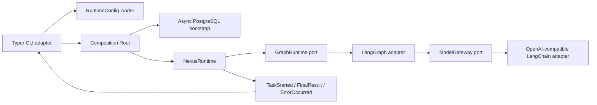

# Day 1 Architecture

Day 1 establishes stable seams without pretending to implement the later coding-agent
lifecycle.



Dependency direction is `interfaces → application → domain ports ← infrastructure`.
LangGraph, LangChain, SQLAlchemy, asyncpg, and Typer do not enter the Nexus domain
contracts. Concrete construction occurs only under `src/nexus/infrastructure/bootstrap/`.

The only graph topology is:

```text
START → model_response → END
```

There are no placeholder nodes for repository exploration, context, planning, approval,
tools, observation, validation, repair, or persistence.

