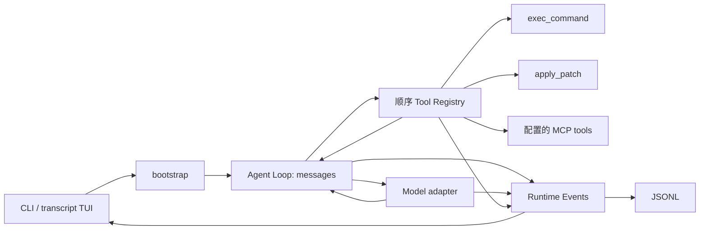

# Nexus Next V0：开发设计

状态：**APPROVED v0.2 / Phase 2 Implementation** · 2026-10-01
用户在本次实施任务中明确批准本开发设计与验收清单（IMPLEMENTATION AUTHORIZATION: APPROVED）。按 S1 → S5 连续实施；实际验收状态见 acceptance-evidence.md。不另设 ADR 审批层。

## 1. 最小运行结构



主循环负责消息协议和执行生命周期；工具负责产生事实；模型负责探索、规划、修改、验证及修复。没有独立 Planner、Validator、Repair、Replan 或任务成功判定器。

建议最终目录如下；允许私有 helper 等价调整，不引入额外层级：

```text
src/nexus/
  __init__.py          # 包版本
  __main__.py          # python -m nexus
  core/
    __init__.py
    agent.py          # 唯一 Agent Loop
    types.py          # 少量 dataclass、Literal、Protocol
    model.py          # 薄 OpenAI-compatible adapter，隔离 SDK 协议细节
    context.py        # 指令、预算、run 活动上下文投影
  tools/
    __init__.py
    registry.py       # 两个 native schema + 简单 dict registry
    execution.py      # shell、输出读取、timeout/cancel
    patch.py          # workspace 内文本 patch
    mcp.py            # SDK 生命周期与工具适配
  app/
    __init__.py
    cli.py            # argparse、入口、退出码
    bootstrap.py      # 唯一依赖组装、资源生命周期
    config.py         # 用户 TOML + 环境变量
    session.py        # JSONL 写入/重放/列表/锁
    events.py         # 一个 emit 分发函数
    tui.py            # transcript、输入、选择器、首次配置引导
scripts/swebench_v0.py # 开发路径；不进入普通 runtime
tests/                # 按上述行为分组；不按旧 Day 分组
```

上表共 14 个功能模块、2 个根入口文件及 3 个 package 初始化文件，合计 19 个 Python 文件；仅作为布局说明，文件数/行数不是配额或验收门槛。三个 package 只分组现有职责，不增加 service/repository/DI 层。

`core/agent.py` 只依赖 Nexus 最小类型/协议和标准库，不导入 SDK 或具体工具。core 不导入 CLI、TUI 或进程工具实现；SDK 格式集中在 `core/model.py` adapter，循环中没有百炼分支。tools 可依赖 core 的最小共享类型；`app/bootstrap.py` 组装工具、provider、JSONL 和 TUI。CLI 与 eval 调用同一个 runtime，不另建 import 检查平台。

## 2. 最少类型与接口

使用标准库 dataclass/typing；不重新建 domain entity、repository port 或通用 service hierarchy。下面是语义契约，字段使用普通 JSON 值，不透出 SDK 类型。

| 类型 | 必需信息 |
| --- | --- |
| `Message` | `role: system/user/assistant/tool`、`content`；assistant 可带 `tool_calls`，tool 必带 `tool_call_id`；可带 adapter 专用的不透明 `protocol_data`，见 §4 |
| `ToolCall` | `id`、`name`、`arguments_json`；保存原始 JSON 字符串，使参数错误也能回给模型 |
| `ToolSpec` | `name`、`description`、`input_schema` |
| `ToolResult` | `call_id`、`ok`、`data`、`error_code?`、`duration_ms`、`truncated`；输出为合法 JSON 文本 |
| `ModelReply` | 完整 assistant message、`finish_reason`、`usage?`；usage 字段可为 unknown |
| `RuntimeEvent` | `kind`、`timestamp`、`session_id`、`run_id?`、`data`；工具事件带 call_id；公开 data 不含 protocol_data |
| `RunResult` | `outcome: completed/limited/aborted/failed`、`final_text?`、steps/tool_calls/usage/duration |
| `Session` | messages、workspace、session_id；每次用户提交创建新的 run_id 与当轮计数 |

仅保留三个替身测试需要的接口：

```python
Model.complete(messages, tools, emit) -> ModelReply     # async，内部流式收集
Tool.execute(arguments, execution_context, emit) -> ToolResult  # async
EventSink(event) -> None                               # async
```

`run_turn(session, user_text, model, registry, emit, limits) -> RunResult` 为 async 函数。取消用 asyncio task cancellation，不另造 cancellation framework。`protocol_data` 只是随 message 往返的可选 JSON 值，只有 adapter 解释；循环不读取其字段做决策，持久化边界只在必要时原样保存。上述是项目内部契约，不承诺第三方 Python SDK 兼容性。

工具输出先按字段裁剪，再序列化成合法 JSON；不能把整个 JSON 字符串截断成无效语法。execution_context 仅含 workspace、当前 call_id、shell/输出限额等执行事实，不带 Plan 或风险模型。

## 3. 主循环与完成语义

```text
创建新 run 或消费显式 resume 边界；写入 run_started、本轮 user message
for step in 1..max_steps:
    active_context = ContextBuilder.build_active_context(session, run_id)
    检查 active_context 输入预算；达到 85% 时尝试安全压缩，再重新投影
    等待 model.complete(active_context)（增量仅用于展示；收集完整响应）
    检查响应结构与 finish_reason
    持久化完整 assistant message
    如果包含 tool_calls:
        按响应顺序逐个 registry.execute
        每次执行前落 tool_started；执行后落完整 tool message
        然后才进入下一个 model step
    否则，如果正常 stop 且正文非空:
        返回 completed
    否则:
        返回 failed（协议错误/截断等明确原因）
超过预算返回 limited；用户取消返回 aborted
```

实现必须满足以下语义：

- 含正文和 tool calls 的响应仍执行工具；正文是过程说明，不是提前 final。工具结果不写成普通 assistant 叙述。
- 一次 assistant message 中每个 call 都有且仅有一个匹配的 tool result，且下一次模型请求前配齐。ID 缺失/重复属于协议错误，不执行这批调用。
- 未知工具、参数 JSON 错误、patch 冲突、命令非零退出、timeout、MCP 工具错误形成 `ok=false` 的 observation。模型可自行修正；不凭这些失败结束 run。
- 正常工具失败后，同批其余调用仍按序执行；取消与不可恢复的 runtime 故障则停止派发，并补记剩余调用未执行的事实。
- `max_steps=40`；step 是主循环的一次常规模型完成操作；重试记 attempt、实际 API 请求另计 model_calls，工具数量另计。末步工具可以执行，随后到限返回 limited；不额外调用模型伪造成功总结。V0.1.1 的安全压缩请求另计 model_calls/usage，不消耗常规 step；每个请求边界最多尝试一次。
- `length`、不完整流、过滤/协议拒绝等都不能视为正常 final；默认明确 failed，不自动执行半截工具参数。用户可以通过 /resume 选择未完成会话，再输入指令续接该 run。
- 模型网络/服务请求在尚无任何响应 delta 时，对连接失败、429、5xx 最多重试一次，短退避；SDK 自动重试关闭，避免重试层叠。401/参数错误直接失败；产生 delta 后不重试整次请求。
- 任一工具都不自动重试；无法确认副作用是否发生时记录 unknown，禁止以恢复为由再次执行。

`completed` = 模型正常结束本轮，**不等于测试全通过或需求已由外部验证**。系统提示要求最终答复简述修改、实际运行的检查及尚未完成事项；Nexus 不新增 validation 节点来强制任务验收。官方 benchmark verdict 独立保存。

## 4. 模型 adapter

使用官方 `openai` Python 客户端的 async Chat Completions；将 Nexus messages/tool schemas 转为请求，最终只返回 Nexus `ModelReply`。不发送旧 JSON Plan/AgentDecision schema，不按模型名分支建立工作流。

- 请求使用 `stream=true`、单个 choice、原生 function tools；按 call index 组装 id/name/arguments 增量。完整响应通过检查后才交给循环执行。
- usage 以 provider 报告为准；缺失不是 0。请求 usage chunk 的兼容开关只影响该 API 参数，不形成 feature-flag 框架。usage-only chunk 不作为空响应或新 step。
- 请求只发必要字段；不默认发送 temperature、厂商私有 thinking 参数或 `strict` schema 要求。工具 JSON 参数在执行边界验证。
- `model.reasoning_effort` 是可选配置；设置时原样作为 Chat Completions 顶层参数传入，未设置则省略，不在 Core 按厂商/模型名映射。首测固定 `high`，不能为通过测试偷偷降级或禁用思考。
- 兼容性要求：支持流式正文、function tools、多轮 assistant/tool messages、call id 对应关系。某服务仅支持“文本 JSON 模拟工具”不算满足该要求。
- reasoning-only delta 仅维持“模型生成中”的活动状态，不能判成空 final。TUI、普通日志、`--json` 和遥测不展示/导出私有 reasoning；这不等于丢弃服务必要的协议续接字段。
- request timeout 默认 120 秒；API key 只从指定环境变量读取。错误输出不包含 Authorization/header 或完整 request dump。

**协议续接的完整往返：** S1 在指定百炼 endpoint 实测是否要求 `reasoning_content` 等字段，不从 DeepSeek 自营或其他服务推定。确有要求时，adapter 收集必要字段到 message 的 `protocol_data`，并在下一请求重建服务要求的 assistant message；不需要的字段不保留。循环只保存/传递整个 message，不把这些内容当作 planning/reasoning 状态、额外阶段或工具观察。

`protocol_data` 最少包含 adapter 格式标识、非敏感的 endpoint/model 绑定标识与需要回传的字段。仅同一兼容服务配置的 adapter 使用，不能把某服务的续接数据自动发给另一个服务。它随所属消息一起保留或从有效上下文移除，计入实际模型输入预算；不能独立截断、文本摘要化或展示给用户。活动上下文只带当前 run 所属的协议数据，不跨 run 携带。

**必要保存：** 若后续正常 resume 确需这些字段，就在同一用户本地 session JSONL 对应 message 行的可选 `protocol_data` 字段保存最低必要数据，reader 恢复时重新附到 message。它是用于 API 续接的本地会话数据，不是普通可观测日志。若只需本轮内存则不落盘；完全不需要则不收集。依赖用户目录访问权限，POSIX 新建文件使用仅当前用户读写权限，Windows 使用用户目录权限；不新增加密/钥匙串系统，不保存 API key 或请求 header。

公开事件和 eval/trajectory 的可分享导出始终剔除该字段；不得把整个 SDK response 直接落盘。恢复时如必需数据缺失/损坏或服务已改变，adapter 明确说明无法按该协议续接，不伪造字段、不重放工具；支持时可以仅凭公开历史继续，否则提示新建会话。上述必要字段适配与验证属于本设计批准后的 adapter 常规职责，无需逐字段重审架构；只有确实新增运行时能力时才提出范围变更。

协议核查来源：[OpenAI function calling](https://developers.openai.com/api/docs/guides/function-calling) 与 [Chat Completions API](https://developers.openai.com/api/reference/resources/chat/subresources/completions/methods/create)。这些来源用于核实工具消息和流式格式；本项目的重试、预算与完成规则是本文提出的实现选择，不是服务保证。

**指定首测 profile：** 阿里云百炼直供 `deepseek-v4.1-flash`，不使用其他供应商前缀或 DeepSeek 自营地址。v0.1 设计时核查的官方 [模型页](https://help.aliyun.com/zh/model-studio/deepseek-v4-1-flash) 列明 Function Calling 与 1,000,000 context；[DeepSeek API 文档](https://help.aliyun.com/zh/model-studio/deepseek-api) 列明 `high` 推理强度及流式 usage 用法。尚无该账户/endpoint 的 live PASS，S1 以实际服务行为核验。Base URL、region/workspace、API key 环境变量均由配置注入；SDK adapter 保持通用。

## 5. 两个原生工具

### 5.1 `exec_command`

输入：`{command: string, workdir?: string, timeout_ms?: integer}`。三字段以外的参数返回错误。command 非空；timeout 默认 120,000 ms，允许 1–600,000 ms；不提供后台 job、PTY、stdin 交互或另一个轮询工具。

默认 cwd 是本次 workspace；相对 workdir 相对 workspace 解析，显式绝对目录可以在 workspace 外。检查目录存在后启动，不做命令语义分类、不拆 argv 制定授权、不改写用户命令。子进程继承当前执行环境；运行上下文告知模型实际 OS、shell、workspace。

Windows 默认优先 `pwsh`，没有则 `powershell.exe`，固定 `-NoProfile -NonInteractive -Command`；Linux 默认 `/bin/sh -c`。可在用户 TOML 指定 shell 可执行路径，仍使用该平台的固定启动方式，不支持任意 launch template。Windows 在命令前统一 UTF-8 输出编码，不改变错误处理语义。模型应使用实际 shell 的语法；不宣称跨 shell 脚本兼容。

`tools/execution.py` 使用 `asyncio.create_subprocess_exec(shell, fixed_args..., command)`；只有 executor 管理进程。stdin 关闭，stdout/stderr 并发读取，不能等进程退出后才读取管道。

结果必带：`command`、解析后的 cwd、shell、`exit_code: int|null`、stdout、stderr、timed_out、cancelled、truncated、duration_ms。exit_code 是 shell 的实际退出码，不推断脚本内部每条命令成功与否。输出被截断时照实标记，不把截断输出当作完整测试证据。

可靠性约束：

- stdout/stderr 共用 `execution.output_limit_bytes` 总预算；初始默认建议 32 KiB，S2 用真实读源码/测试输出检验后可调整，无需修改架构契约。仅 stdout 有输出时可使用全部额度，stderr 同理，不永久预留一半空额度。
- 一个带 stream 标记的有界 head/tail 缓冲保存头尾，再还原 stdout/stderr 字段；超限仍持续 drain，并分别记录 truncated/discarded bytes。使用增量解码，非法字节替换并标记。TUI delta 同样有界，不以 streaming 绕开限额。V0.2.1 在请求层对已消费的 COLD 结果派生 preview，不改变此处执行输出预算或原始持久化结果。
- timeout/cancel 覆盖启动、等待和管道收尾；管道收尾最多再等 2 秒。输出超限不会提前杀命令，也不会无限占用内存。模型可以用更窄的命令再次读取需要的结果。
- POSIX 创建进程组，取消时先 TERM 再 KILL；Windows 创建进程组，父进程仍存活时用系统 `taskkill /PID ... /T /F` 清理子树；实现与测试都检查普通子进程回收。
- 若无法确认清理，结果明确 `cleanup_incomplete` 并停止当前 run，不能显示已干净取消。主动 daemonize/脱离进程组的任务不属于 V0 支持对象；这不是 OS 安全隔离保证。
- Ctrl+C 的清理路径必须等待或有界收尾，不能把 cancellation 吞成普通成功。

Python asyncio 的管道、异步子进程与 Windows event-loop 约束见 [官方文档](https://docs.python.org/3/library/asyncio-subprocess.html)。Next 不沿用为 PostgreSQL 设置的 Windows Selector loop；使用支持子进程的默认运行方式。

### 5.2 `apply_patch`

输入：`{patch: string}`，普通 unified diff 文本；修改文件用 `--- a/path` / `+++ b/path`，新增/删除用 `/dev/null`。只实现这一种补丁语法，在首测模型验证，不因工具名是 apply_patch 就再实现 Codex 补丁格式。允许同一次调用多个文本文件，工具说明附一个短示例。允许忽略标准 `diff --git`、`index` 前导行；不支持二进制、rename、文件模式变更、symlink patch 或模糊匹配算法，遇到这些格式返回明确 unsupported。

每次 patch 与每个目标文件上限 1 MiB，UTF-8 文本。新文件默认 LF；修改保留原有行及其行尾，新插入行沿用文件主换行风格；支持 no-newline marker。无实际变化返回 no_changes 事实，不伪报 modified。

处理顺序：解析所有文件 → 解析/验证目标路径 → 在内存检查全部 hunks → 顺序写入。目标路径必须是 workspace 相对路径；拒绝绝对路径、盘符/UNC、`..`、空路径。现存路径与新建文件的最近现存父目录均解析 real path 并核验 containment；拒绝经过 symlink/junction 的修改路径；写前再次检查路径与原内容 hash，检测并发变动。

有行号时优先精确匹配；位置移动时，只允许旧侧上下文/删除行在剩余源文中恰好唯一匹配。零匹配或多匹配返回 conflict，保留原文件；不自动猜测相似文本。

修改用同目录临时文件 + replace，并保留原权限；新增不覆盖已有文件；删除只删除本次已核验的文件。预检失败时整批不写入。**仅承诺单文件替换原子性**；若第 N 个文件出现 I/O 失败，返回已成功文件及失败文件，标明 partial，不宣称跨文件事务或盲目回滚。新建父目录是可能的附带变更，也须如实返回。

结果包含逐文件 path、added/modified/deleted、行增删计数、before/after hash、实际应用后的 bounded diff、是否 partial/truncated。超出输出预算时保留计数和截断说明，列出 omitted_files 数量；不能把输入 patch 原样当作成功证据。相同结构驱动 TUI、tool message 与 trajectory，避免退化为只有“修改成功”。

workspace containment 是 patch 的文件边界，不能阻止可信 shell/MCP 写其他路径，也不是抵抗恶意并发文件系统替换的强沙箱。

## 6. 指令、预算与活动上下文

### 6.1 启动上下文

workspace = 启动 cwd 的规范化绝对路径；V0 不向上搜 Git root。文档提示用户在项目根目录启动。只读取 `<workspace>/AGENTS.md`，不存在则跳过；UTF-8、最大 64 KiB，超限/解码失败明确报错，不默默截断项目约束。不读嵌套 AGENTS、不扫描文件、不执行自动 git status/tree、不预索引。

系统提示保持短小：身份、工具用途、探索后编辑、实际验证、失败后继续尝试、遵守用户/项目指令、结果如实说明。固定 system + AGENTS 前缀之后是当前 run 的消息。工具输出是数据，不得提升为 system 指令。每轮只加入必要环境事实，不注入猜测的仓库知识。

### 6.2 预算算法（单一实现）

`model.context_window` 由用户按服务配置给定，不从模型名猜；`max_output_tokens` 默认 8,192，必须小于 context_window。每次请求计算输入预算 `B = context_window - max_output_tokens - 1,024`，B 必须为正。工具 schema、消息包装、AGENTS、工具结果及实际回传的 protocol_data 全部计入。工具执行文字输出预算不变；V0.2.1 的 request-time Observation Projection 先于活动输入估算，不修改原文或 execution truncated 标记。

本地估算采用序列化 UTF-8 bytes / 3 向上取整，加每条消息固定开销；明确标成 estimate。存在上次 provider input usage 时，用其与上次估算的比例校准，并估算新增内容；新 run、成功压缩或 schema/前缀变化时回到本地估算。账单/累计 usage 与当前窗口占用分开，不能把多次请求 token 总和当成当前 context。

Context Runtime V0.1.1 修复 V0.1 误移除安全压缩的回归。预算只计算当前 run 的活动上下文；估算达到 `0.85 * B` 时，在模型请求边界尝试一次安全压缩，目标约为 `0.60 * B`。若 provider 报 context-length 错误且本边界尚未尝试压缩，则强制压缩并最多重试一次；已经尝试压缩、压缩后仍超限或受保护内容无法容纳时返回 `limited/context_limit`。现有工具输出预算不变。

### 6.3 Run 上下文投影与安全压缩（Context Runtime V0.2.1）

`Session.messages` 保留消息历史，`ContextBuilder.build_active_context(session, run_id)` 返回逻辑活动上下文：当前 system/仓库指令 + 该 run 的活动消息。已有压缩时使用最近逻辑快照，再追加快照 seq 之后属于该 run 的原消息。每次请求按 logical context → Observation Projection → estimate/prepare 执行；生成新 snapshot 后 rebuild logical → re-project → check → model.complete。provider 超限 fallback 使用相同顺序，observe 使用实际发送的那份 projected context。

普通输入创建新的 run_id；以前 run 的用户输入、assistant、工具结果和环境事实不自动带入。当前 MCP 不可用事实在 run 开始后写入该 run，并保持模型可见。跨 run 的 tool call id 可以重复，同一 run 内仍拒绝重复；完整 assistant/tool 配对校验保留。

现有 `/resume` / `nexus resume` 选择会话后，如果最近 run 没有 completed（包括缺少 run_finished、aborted、failed、limited），下一次输入使用原 run_id，保留其原请求、assistant、工具结果和必要 protocol_data。恢复的提示词和工具 schema 仍按当前配置加载。已 completed 的会话下一次输入创建新 run。run_id 不新增为 CLI 参数，不增加新的选择器。一次恢复续接仍有自己的 max_steps、usage 和 run_finished，JSONL 通过相同 run_id 关联这些执行段。

Message 的内存 run_id 来自已有事件 envelope，不进入 message.public() 或 provider payload。V0.1.1 的 `context_compacted` 事件增加 `data.scope="run"`，其 envelope run_id 标识所属 run；data 保存摘要、插入位置、kept/replaced seq 引用、估算和 usage。只解析该 run 当前活动消息的引用；旧版不带 scope 的跨 run 压缩事件仍仅作历史审计，不重新带入旧摘要。JSONL schema_version 仍为 1。

安全压缩保留当前 system/仓库指令、该 run 的全部原始用户消息（包括原请求和恢复后的补充输入/环境事实）、最近两个完整交互组，以及每个 HOT ToolResult 所属的完整工具组。HOT 与必要保护内容本身超 B 时返回 context_limit。旧的完整 assistant/tool 组可整体总结，summary 读取 projected history，不展开 COLD 原文；protocol_data 随原消息一起保留或离开活动上下文，不单独摘要或截断。摘要只描述可观察事实。使用同一 model、禁用 tools，摘要正文最多 2,048 estimated tokens，摘要流不直接展示；请求 usage 正常计入总账单。

每次只做一个有界摘要请求，不拆组填预算，不构造摘要树。摘要必须实际减少上下文并使其落到 B 内；受保护内容或剩余历史导致仍高于 60% 目标但未超 B 时给出警告。普通阈值压缩失败、原上下文仍在 B 内时可警告后继续原上下文；原上下文已经超 B 或因 provider 超限强制压缩失败时停止，不循环重试。

成功压缩先追加 context_compacted 事件，再更新 `Session.compactions[run_id]` 的小型投影快照（活动消息引用、summary message、through_seq）。不删除或覆盖 `Session.messages`，不重写旧 JSONL。后续每次请求继续使用该投影，不重新带回已替代的旧结果；再次压缩可替换旧摘要。resume 按事件顺序重建相同投影、恢复必要协议数据，再补齐未知工具结果；损坏尾行恢复复制有效事件，仍可重建投影。

V0.2.1 增加 Tool Observation Lifecycle。consumed 仅由同 run 原始 Session 中后续成功 append 的有效普通 assistant 推导。HOT 全部 FULL；以 `W=min(16384,floor(0.25*B))` 和 `estimate([tool_message], [])` 选择 consumed 的连续最新后缀为 RECENT/FULL，第一条放不下即停止，其余 COLD 尝试 compact-v1。成功/失败的完整 compact JSON 分别不超过 1024/2048 UTF-8 bytes；不节省或不能可靠解析时保持 FULL。每次从原文创建新 Message，不递归压缩，不持久化 preview 或 consumed 状态。

`context_projection` 事件记录本轮 logical context 内工具结果的 FULL/实际 projected bytes 与估算 tokens、HOT/RECENT/COLD 数量。事件进入 JSONL/diagnostics，不进入 Session.messages 或模型输入，不替代 provider reported usage。configuration 与 evaluation manifest 记录策略版本和固定参数。实现细节与离线证据见 [V0.2.1 记录](context-runtime-v0.2.1-evidence.md)。不增加检索、artifact store、长期记忆、soft compaction 或新 Agent node。

## 7. JSONL、事件与恢复

### 7.1 一份事实日志

路径：`~/.nexus/sessions/<workspace_key>/<session_id>.jsonl`。workspace_key 是规范化绝对路径（Windows 规范大小写）的 SHA-256 前 24 位；header 另存完整路径并校验，防止 hash 碰撞串会话。移动/重命名项目后不自动迁移历史。

每行使用 `schema_version=1, seq, timestamp, session_id, run_id|null, kind, data`；message 行仅在恢复确需时增加私有 `protocol_data` 字段，见 §4。seq 为 session 文件内递增编号，时间使用 UTC。首行 `session_created` 保存 workspace、首条用户输入前 80 字作为标题、Nexus 版本及不含凭据的模型设置。没有独立数据库、索引或 sidecar 状态机。

记录示意（非实际运行结果）：

```json
{"schema_version":1,"seq":4,"timestamp":"2026-09-30T08:00:00Z","session_id":"s-example","run_id":"r-example","kind":"message","data":{"role":"assistant","content":"运行测试。","tool_calls":[{"id":"c1","name":"exec_command","arguments_json":"{\"command\":\"python -m pytest -q\"}"}]}}
{"schema_version":1,"seq":5,"timestamp":"2026-09-30T08:00:01Z","session_id":"s-example","run_id":"r-example","kind":"tool_started","data":{"call_id":"c1","name":"exec_command"}}
{"schema_version":1,"seq":6,"timestamp":"2026-09-30T08:00:02Z","session_id":"s-example","run_id":"r-example","kind":"message","data":{"role":"tool","tool_call_id":"c1","content":"{\"call_id\":\"c1\",\"ok\":false,\"data\":{\"exit_code\":1,\"stdout\":\"1 failed\",\"stderr\":\"\"},\"error_code\":\"command_exit_nonzero\",\"duration_ms\":1000,\"truncated\":false}"}}
```

canonical messages 与边界事件持久化；高频 text/output delta 只展示，不重复逐 token 落盘。普通工具结果正文只保留预算内数据，不保存无限原始 stdout。session 可能包含源代码、用户输入和最低必要的私有协议续接数据，只写本地；不存密钥或请求 header。公开事件/日志/导出不包含 protocol_data 或私有推理；本地保存例外仅限 §4 已说明的协议需求。对普通正文中配置已知的凭据值统一脱敏，不宣称能识别所有未知秘密。

### 7.2 事件分发

| 事件类别 | 消费方式 |
| --- | --- |
| session_created、run_started、message、run_finished | 持久化事实；TUI 展示正文/最终状态 |
| model_started、model_finished | 展示活动；保存模型名、延迟、reported/estimated usage 和失败事实 |
| assistant_delta、tool_output_delta | TUI 有界展示；不落逐 token 日志 |
| tool_started、tool_finished | 保存 call_id、状态、耗时；tool_finished 引用对应 tool message，避免重复正文 |
| context_compacted、warning | 保存 run 活动投影或异常事实；TUI 给出简短提示。原始消息继续保留 |

Developer Run Profiler V0.1：Agent 在 `model_started`、`model_finished`、`tool_started`、
`tool_finished` 的 data 增加当前 `step`，保留 `attempt` 和 `purpose="compaction"`。
工具结果的统一记录边界在 `tool_finished` 增加 `result_bytes`（模型可见 ToolResult
message.content 序列化正文的 UTF-8 字节数）、`exit_code`（结果 data 中的值或 null）与
`truncated`。这些字段只进入事件，不进入模型请求；完整工具正文仍只保留在 tool message。

`app/events.py` 的 `emit` 顺序写 JSONL，再通知公开消费者，不建立消息总线、订阅管理器或后台 exporter。持久化 message 时可通过仅内部使用的可选参数附带 protocol_data，writer 将其放入同一条本地记录；TUI、`--json`、普通日志、eval 可分享导出和未来 OTel 只得到不含该字段的 RuntimeEvent。无需另一套事件平台，测试直接验证公开消费者从未收到私有载荷。

JSONL 保持单写者追加，按执行顺序写 message/tool_started/结果。建议每条完整记录写后 flush、正常退出 flush/close；是否及何时 fsync 由实现选择并记录，不固定逐执行边界 fsync，不承诺耐断电事务或 exactly-once。写入/flush 错误必须可见，停止派发下一副作用并说明当前运行不可完整恢复；正常退出和进程中断恢复需要实测。日志缺项不能证明副作用未发生。

TUI 渲染错误降级为纯文本，不修改模型消息；future OTel sink 必须内部吞掉自身导出失败，不影响运行正确性。这里区分“必要会话数据写入”和“可选遥测”，避免把所有 sink 都无条件 fail-open。

### 7.3 Resume

`nexus resume` 或 `/resume` 仅列出当前 workspace 的历史：标题、项目目录名、更新时间、最后 outcome；没有 run_finished 的显示 interrupted。扫描本地 session 文件读取元数据不属于仓库扫描；列表按更新时间排序，不引入索引。空列表显示提示；上下键 + Enter 选择，Esc 取消。

选择后恢复完整 messages 历史，并按 §6.3 标记最近未完成 run，必要时重新附上本地 protocol_data，由 adapter 核对服务绑定和续接要求；读取当前根 AGENTS 和当前模型/MCP 用户配置，模型/指令/schema 变化用 warning 明示。旧 tool messages 作为历史保留，新的工具调用只查当前 registry。不恢复 graph、Plan、进程或执行位置；显示最近对话后等用户输入，不自动继续任务。

恢复异常按下面唯一规则处理：

| 情况 | 行为 |
| --- | --- |
| 崩溃后 assistant 有 call，无 tool result | 补 synthetic tool result：`interrupted_unknown`，即使缺 tool_started 也不推断未执行；提示先检查实际状态，不自动重放 |
| 运行时取消，明确知道同批剩余 call 尚未派发 | 写入 `not_executed`；resume 保留该事实，不执行旧调用 |
| 只有未完成的流式 delta | 不当成完整 assistant message 恢复 |
| EOF 最后一行截断/无效 JSON | 只读合法前缀，提示恢复；写入新的 session JSONL（header 记录 recovered_from，复制合法上下文/必要事实），保留原文件不改写，之后写新文件 |
| 中间行损坏、seq 异常、未知 schema_version | 明确拒绝恢复该文件；不静默跳过，不猜测 schema |
| 同一 session 已由其他进程写入 | 拒绝第二 writer；使用标准库平台文件锁，进程退出释放，锁不作为工作流状态 |

新恢复文件有独立 session_id，来源保存在 header；按原顺序复制全部有效事件，保持 seq、run_id、protocol_data 与事件引用一致，再补齐 unknown 结果。损坏尾行不复制，原文件保留。普通正常 resume 继续追加原文件。没有 exactly-once 承诺：进程可能在副作用完成与结果落盘之间崩溃；合成结果用于诚实表达未知，不能伪造 rollback。

## 8. MCP 是工具来源

`tools/mcp.py` 使用官方 `mcp` SDK 2.x 的 `Client` / `StdioServerParameters`，由 `app/bootstrap.py` 的 AsyncExitStack 管理 Conversation 生命周期。首次任务惰性建立 ChatModel client、MCP 连接及发现结果，与 native registry 一起跨 turn 复用；不逐轮 spawn/handshake/discover。逐个连接用户级 TOML 配置的 server，遍历 `list_tools` 所有分页，将 description/input schema 转为 ToolSpec。server 级无效配置、缺失环境变量、连接/发现超时、分页 cursor 重复或无效定义按该服务器失败处理，不无限等待；整份 TOML 语法损坏仍属于配置错误。

`/new`、选择 resume、新启动进程建立新的 Conversation，显式 `await close()` 释放旧连接和模型 client，最后关闭 session writer。MCP 异步上下文在同一拥有者任务中打开和关闭；CLI 在该任务顺序执行 turn，SIGINT 仍通过取消当前 turn 交还 prompt。每轮更新项目指令、配置指纹和 session 事件，不增加配置热更新或连接管理层。调用阶段失败或取消的 server 在当前 Conversation 内持续停用，不自动重连；新的 Conversation 才重新发现。

公开工具名由 `(server_id, remote_name)` 生成稳定的 ASCII function name，满足 provider 长度/字符限制：可读前缀 + 原始二元组的短 hash，保留反向映射并检查冲突；不依赖 `mcp.server.tool` 中的点号被服务接受。native 工具名不能覆盖。

连接/发现失败只停用该服务器，丢弃其不完整发现结果，清晰提示 server 名与原因；两个原生工具和其余健康 server 工具照常提供。给模型一条简短、非指令性的本轮工具不可用事实，不能默默假装 MCP 完整可用。若任务依赖它，模型须说明未完成事项，不能把未执行的外部动作说成成功；无需为此增加任务依赖判定器。

无 MCP 配置时完全跳过。调用阶段断连/错误形成 tool observation，副作用未知时如实记录；可停用该失联服务器并更新可用工具清单，但不自动重连、不重试带副作用调用、不重新发现新增工具。用户重新进入会话时重新连接。没有健康检查平台或 failover 子系统。

文本块与 structured JSON 按统一预算回传；`is_error` 保持失败语义。非文本内容返回类型与不可用说明，明确标记 unsupported content，不把 base64 塞入上下文，也不自动抓 resource URL。timeout 使用同一调用预算，取消关闭本地客户端/子进程并说明远端副作用可能未知。

不注册 sampling/elicitation handler，不开启 SDK 的自动多轮 input-required 处理；服务请求这些能力时返回不支持的工具结果。MCP server instructions、工具描述或结果不会成为高优先级项目指令。配置只读用户目录，不自动读取仓库 MCP 配置，不从 repo 安装服务器。

核查来源：[MCP Python SDK Client](https://py.sdk.modelcontextprotocol.io/client/)。SDK 生命周期、工具 schema、`content`/`structured_content`/`is_error` 与 Nexus 适配契约分别处理。

## 9. CLI、TUI 与配置

### 9.1 用户入口

| 入口 | 行为 |
| --- | --- |
| `nexus` | 未配置时先进行最小配置引导；就绪后开启当前 workspace 交互会话，首次任务提交才创建 session 日志 |
| `nexus exec "任务"` | 同一 runtime 的一次任务；适合自动化，不打开 resume selector |
| `nexus exec "任务" --json` | stdout 每行一个公开 RuntimeEvent（不含 protocol_data）；诊断写 stderr，最后一行 run_finished |
| `nexus --profile`、`nexus exec "任务" --profile` | 可选开发诊断；每次 drive 返回后打印该轮统计，与 `--json` 互斥 |
| `nexus resume` | 当前 workspace 会话选择器 |
| `/resume`、`/new`、`/exit`、`/help` | 只在空闲输入阶段处理；不发给模型 |

一次性退出码：0=completed，1=failed，2=配置/参数错误，3=limited，130=aborted。0 不代表 benchmark resolved。无 TTY 的普通 `nexus`/`nexus resume` 返回可操作提示，自动化应使用 exec；不挂起等待不可见输入。`--help`/`--version` 不要求 API key 或模型连接。

`app/profile.py` 的小型事件消费者与 Transcript 接收同一公开事件流，不参与 Agent 决策。
`run_started` 重置指标，恢复执行段也独立统计；报告使用实际 writer.path。累计 token
成本包含重试/压缩请求，活动上下文和逐步时间线取成功普通请求，缺失 usage 不估算。
Profiler V0.1.1 在 usage 不完整时按字段累计已知值，以 `≥` 标明下界，并显示完整 reported
usage 请求数 / 总请求数；无已知值仍为 unknown。模型失败按已有 error 分类，未收到 finish
记为 unfinished，重试仅按 attempt > 1 计数；ChatModel 失败结束事件也记录 duration_ms。
时间线最多展示前 3 + 后 7 步。采集或渲染失败只降级诊断，不改变 RunResult。
不带 `--profile` 时保留原终端输出；不增加聊天命令、后台 worker 或遥测后端。

TUI 用 prompt_toolkit 的 async 输入和 Rich 文本/diff 渲染；只使用一个 asyncio loop。运行时暂停接受新任务，仅保留 Ctrl+C；空闲 Ctrl+C 清空输入，`/exit`/EOF 退出。先支持可靠顺序交互，不实现运行中 steering、后台任务或 full-screen 面板。

Transcript 始终可滚动：用户输入 → assistant streaming → 单行工具摘要、状态与耗时 → patch 路径与差异预览 → 最终答复 + tokens/耗时。model_started 不留永久行；普通工具只在结果到达后留一行，支持的 TTY 在执行期间显示可擦除活动行，无后台刷新线程，重定向/dumb terminal 不显示临时行。轻量 Read/Search/Test/Inspect git 分类只服务 UI，复杂/过长命令统一 Run shell command，不解析 shell、不影响执行。默认不展开 shell/MCP 的工具正文或输出 delta；失败显示最多四行错误摘录，patch 最多展示三个文件、每文件六行 diff，长行限宽，省略明确标记。该收缩仅属于展示层，模型 tool message、会话日志和 `--json` 继续保留原工具预算内结果；不展示私有 reasoning。色彩只区分角色与状态；尊重 NO_COLOR、窄终端和重定向。工具控制字符过滤后再显示，避免覆盖终端提示；正文流与最终正文不能重复打印。

短 System Prompt 仅增加独立、只读探索可合并到一次有界 exec_command 的行为提示，并要求命令可读、不合并副作用操作。Runtime 不自动合并调用、不增加 batch 子系统或改变顺序执行语义。reasoning_effort 继续由用户配置，不增加自动路由。

UI 不读取文件猜工具结果，不自己判测试通过；只消费事件。输出刷新节流到约 20 次/秒；不能在内存里累积整段无限原始输出。输入处理方式参考 [prompt_toolkit asyncio 文档](https://python-prompt-toolkit.readthedocs.io/en/stable/pages/advanced_topics/asyncio.html)。

### 9.2 用户配置

仅加载 `~/.nexus/config.toml`；不加载 repo `.nexus/config.toml` 或 `.env`。`NEXUS_MODEL_NAME`、`NEXUS_MODEL_BASE_URL` 可覆盖 TOML 对应字段；API key 来自配置指定环境变量（默认 `NEXUS_MODEL_API_KEY`），不允许在 TOML 写 key 值。其余参数只从 TOML/default 解析，不支持任意多层配置框架。

```toml
[model]
name = "your-tool-capable-model"
base_url = "https://your-service.example/v1"
api_key_env = "NEXUS_MODEL_API_KEY"
context_window = 32768  # 示例：须填写目标服务的实际上下文限制
max_output_tokens = 8192
include_usage = true    # 服务不支持 stream_options 时可明确关闭

[runtime]
max_steps = 40

[execution]
output_limit_bytes = 32768  # 初始默认；共享总预算，可按实际输出调整
# shell = "C:/Program Files/PowerShell/7/pwsh.exe"

# 可选：只填写自行信任并已安装的 stdio server
# [mcp.servers.example]
# command = "/absolute/path/to/server-executable"
# args = []
# env_from = { SERVICE_TOKEN = "SERVICE_TOKEN" }  # 子进程变量 -> 本机变量名

```

model name/context_window 必填；base_url 未填时使用 SDK 官方 endpoint；key 缺失时给出变量名，不打印值。允许本地兼容服务使用用户设置的占位 key，不要求付费云模型。配置未知字段、无效数值或 TOML 语法错误给出路径/字段诊断，不在任务中途猜默认；MCP 单服务器问题按 §8 降级处理。

**首次使用：** 有 TTY 的普通交互入口尚未配置模型时，提供一个简短引导，收集 model name、Base URL、context window 和 API key 环境变量名，可填写 reasoning_effort。展示非敏感配置摘要后保存到用户级 TOML，保留已有无关配置/MCP 段；取消则不写文件。只让用户提供环境变量名，不输入、读取展示或保存 key 值，不添加钥匙串、.env 加载器或账号系统。已有文件语法损坏时不覆盖，提示用户修正。

保存后检查所需环境变量是否存在。缺 key 时显示当前 shell 设置该变量的示例（只含占位符），提示在同一终端设置后重新启动；不发模型请求、不假装已就绪。one-shot/无 TTY 入口缺配置直接返回 exit 2 与所缺字段/配置示例，绝不启动向导或等待输入。help/version 不触发引导。这补齐首次安装体验，不增加安装管理系统。

首测使用下列 model 段替换上面的通用示例；占位 Base URL 需按用户控制台填写，不能直接发请求：

```toml
[model]
name = "deepseek-v4.1-flash"
base_url = "https://<your-bailian-endpoint>/compatible-mode/v1"
api_key_env = "DASHSCOPE_API_KEY"
context_window = 1000000
max_output_tokens = 32768
reasoning_effort = "high"
include_usage = true
```

32,768 是首测客户端输出预算提案，给 high 模式留出空间，不是服务最大值；输出 token 计数包括 provider 报告的思考开销。`max_output_tokens` 由 adapter 映射至该 Chat Completions 契约的 `max_tokens` 字段；不把两者重复发送。live 记录实际参数及 finish_reason，预算不足如实报 length。等价的输出限额字段适配属于 adapter 实现工作，不因此新增模型路由或架构审批。当前没有任意 `extra_body` 透传机制；首测按服务默认思考模式加 high 参数进行。

只引入 `openai`、`mcp`、`prompt-toolkit`、`rich` 四个直接运行依赖；SDK 的传递依赖不等于 Nexus 分层。`argparse/tomllib/dataclasses/json/pathlib` 用标准库。沿用 hatchling、pytest/pytest-asyncio、ruff、mypy 与 uv.lock；版本在实施时按已验证的发行版本锁定，不凭本设计编造版本号。不把 swebench/Docker 加入普通安装。

## 10. Eval V0 的薄接入

开发脚本负责：读取明确选择的案例 → 在外部准备好的 workspace 调同一 `run_turn` → 采集实际 workspace diff → 写官方 predictions → 关联官方 report。顺序 batch 即可；不创建 Eval Lab、通用 evaluator、LLM Judge 或自动 RCA。

输入任务 JSONL 仅需 `instance_id, repo, base_commit, problem_statement, workspace`。workspace 由外部开发/benchmark 准备流程在隔离环境准备；脚本核对开始时 HEAD=base_commit 且干净。只把 problem_statement 和正常指令交给模型，不提供 gold patch、test_patch 或官方 grading 结果。干净工作区不等于无答案泄露：正式评测的外部准备还须排除可访问的未来官方修复/答案（含 Git refs/objects、可见文件与其他挂载资料），记录网络是否可用及其限制。无法做到时标为受污染/非正式实验，不作为干净 benchmark 能力证据；Nexus Core 不增加反作弊或安全平台。

预测基准固定为 case 输入的原始 `base_commit`，目标为任务结束时实际文件内容；包含 tracked 修改/删除和新增未忽略文件，不能只累加 apply_patch 结果，也不能默认对比结束时 HEAD。模型在可信 shell 内 commit 后，已经提交的修复仍必须进入 prediction，不增加 Git denylist。

在隔离 workspace 用独立临时 Git index 从原始 base_commit 构造结束时文件树，再与该 base_commit 比较；不改用户原 index。开始时记录可解析的 base commit 对象 ID，结束时若该基准无法读取则报采集错误，不能改用 HEAD 或伪造空 patch。空 diff 保持空；runtime 异常仍保存可获得的 trajectory/patch，并单独记录 outcome。collector 使用公开事件视图导出可分享 trajectory，不复制本地私有 protocol_data。

官方 prediction 每行仅需 `instance_id, model_name_or_path, model_patch`；Nexus sidecar `runs.jsonl` 保存 instance_id、run_id、trajectory、patch hash、model、tokens（注明未知/估算）、latency、tool calls。收集器从固定 harness 版本的官方报告读取 resolved/unresolved/error 与原报告路径；报告缺失记 unknown，不从 Nexus completed 推断 resolved。

官方 grader 负责测试环境与 FAIL_TO_PASS/PASS_TO_PASS 判定。一次真实 sample 的对接验收可 resolved 或 unresolved，但必须有真实官方报告；产品简单任务验收仍须单独通过，不能拿“接通 grader”代替“能完成任务”。Linux/Docker 只属于该评测环境。

格式与运行入口核查来源：[SWE-bench 官方 Evaluation Guide](https://www.swebench.com/SWE-bench/guides/evaluation/)。记录 harness 版本及原始 artifacts，避免上游报告变化被静默吞掉。

## 11. 开发硬停止线

遇到以下情况报告证据与选项后等待设计修订：必须引入第二 runtime/模型路由、要恢复 Plan/policy/validation 节点、要加第三个 native 工具、需要额外直接运行依赖、目标模型必须支持本文排除的协议、必须改变恢复/完成/patch 边界，或需要覆盖用户既有未提交工作。

常量/输出预算调优、helper 拆分、等价 SDK 字段适配及 §4 的必要协议续接不触发额外审批；实现后提供对应验证即可。文件锁、消息配对、取消清理和错误传播不应扩展成新的平台。编码时以实际产品验收为终点，不以知识问答或行数配额作为门禁。
