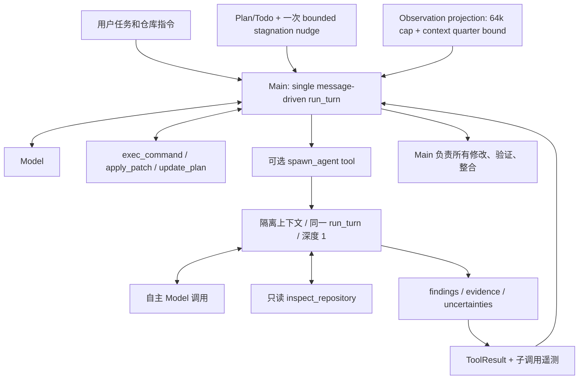

# dev6 最终控制验收：FAILED — KEEP V0.2

2026-10-09。受测源码 `3251ba9bf6befd5d76b845693d77c94ec2746fb2`，版本 `0.3.0.dev6`，开发分支 `codex/nexus-observation-retention`。

**不推荐 merge / release。保持稳定 V0.2。** 同一候选的三题均 official FAIL；C08 正样本从 PASS 退化，C17 最后写入产生语法错误，C13 仅部分改善，SubAgent 仍没有真实价值证据。本轮控制实验结束，不重跑失败 Agent，不运行 holdout，不改 main。实验源码保存在开发分支供复盘，不作为推荐生产版本。

此前 dev3/dev4 的 [最终冲刺 FAILED 报告](v0.3-final.md) 仍有效。dev5 的 post-mutation nudge 未在实测中触发，已撤销；本报告是后续单因素 observation retention 实验，不覆盖、挑选或改写旧实验结论。

## 1. 最终实验架构

没有 Planner/Validator/Repair 固定图，没有 Tool Scheduler。Main 调用子 Agent 时等待；workspace 只有 Main 写入。

## 2. 相对 V0.2 的实际变化

- 保留 V0.2 Plan/Todo、request-only planning projection 和一次 bounded nudge。Detector 仍只在成功 patch 前提醒；shell 写入识别及 post-mutation 收敛是现有限制。
- 新增受限只读 SubAgent、子调用事件/usage，通用接口覆盖与独立委派指导。
- 保留 Batch1 中 patch schema 示例/恢复提示、相对路径说明，以及 model request/TTFT/generation/usage、tool shell/returncode/timeout 遥测。
- 撤销 ProgressLedger、Validation Debt、completion interception/nudge、shell purpose/scope 等复杂机制。没有用已实现作为保留理由，也没有单因素证据证明撤销本身提高能力。
- 本次唯一新策略变量：full-observation working-set cap 从 16,384 到 65,536 estimated tokens；仍受 context budget 的四分之一限制，HOT、连续近期结果、cold preview 和原始历史规则不变。相对 dev4 运行时只改 observation cap 和版本号。

相对 V0.2，运行时共 9 个文件、365 行新增、4 行删除，其中 SubAgent 284 行。复杂度增加尚未换来整体任务提升；64k 只保留在实验分支，不能凭 C13 局部改善推荐合并。

## 3. SubAgent 设计及真实价值

`spawn_agent(task)` 复用普通 Agent Loop，接收根指令与 Main 明确给出的窄问题，不复制 Main 全部对话。工具只有仓库内 list/read/literal search；无 shell、patch、MCP、二次 spawn。

边界：深度 1，每 Main run 最多 2 次，每次 6 steps / 150s，context ≤24k、每请求 output ≤2048 tokens，工具 observation ≤8k bytes，最终报告 ≤6k bytes。独立 findings/uncertainties 报告应包含 path:line 证据；非结构化输出明确标记，不编造 findings。Main 拥有最终整合责任。子调用计入原 900s 墙钟限制，child turns/usage 另行统计。

**本候选三题：0 calls / 0 child steps / 0 child tokens / 0 child cost。没有真实调用案例，没有 Main 利用子发现的证据。** 包括此前 dev3/dev4 六次执行及 dev5 一次执行，十次真实开发执行都没有触发委派。单元测试验证隔离、边界和回传，不证明真实任务价值。不能据此说 SubAgent 没有价值，只能说该实现和使用策略未通过价值验收。

## 4. 同一候选三题对照

| 题目 | V0.2 official / F2P / P2P | dev6 official / F2P / P2P | Steps | 首次实际修改 | 最后修改和验证 |
| --- | --- | --- | --- | --- | --- |
| C08 | PASS / 21/21 / 30/30 | FAIL / 20/21 / 30/30 | 15 → 12 | 5 / 40.1s → 7 / 81.1s | dev6 最后写入 7；自检、10 个现有测试及编译通过，漏掉精确边界 |
| C17 | FAIL / 4/14 / 74/74 | FAIL / 导入失败，未收集测试 | 50 → 50 | shell 11 / 35.8s → patch 15 / 93.1s* | dev6 最后写入 50；同命令 import 已报 SyntaxError，未修复 |
| C13 | FAIL / 162/202 / 245/245 | FAIL / 168/202 / 245/245 | 50 → 41 | helper 9 / 25.5s → 8 / 38.6s | dev6 最后写入 35，之后 smoke 和部分现有测试通过；接口仍有遗漏 |

首次修改包括 shell 写入，不将首次成功 apply_patch 当作全部修改。* C17 第 21 步附近存在一次事件时间戳回跳；按事件 seq 确定首次修改，逐步秒数是记录值，不作精确因果比较。总延迟使用已报告的 monotonic process duration。

- **C08**：完美正相关返回 `0.9999999999999997`，官方要求精确 `1.0`。Agent 的 smoke 使用容差，所以没有暴露错误。12 次 context projection 均与旧 16k 相同，不能把退化归因于 cap；它仍是本候选的正样本失败。
- **C17**：覆盖了 6 个文件，但第 44 步才写 merge，第 50 步才写 formatting/coordinates。最后 shell 生成字符串时引入 `formatting.py:795` unterminated string literal。F2P 和五个 P2P 测试命令都在 conftest 导入时 exit 4；官方数组为空，不能写成正常执行的 0/14 或 0/74。最后 import 明确报错，`| tail` 仍让工具 ok；50-step budget 随后耗尽。测试失败可见，但没有完成修复闭环。
- **C13**：Plot 主体从第 41 步 / 404.9s 提前到 26 / 285.5s，新增 9 个通过、退化 3 个、净增 6 个。paired、facet labels 等仍失败，部分自检通过不能支撑最终“全部接口已验证”的表述。成功修改均通过 shell，三个 patch 都因上下文不匹配失败。

C17 的 50 次 projection 全部重建匹配，33 次请求与 16k counterfactual 不同，从第 18 步起生效；末次完整工具 observation 估算 61,555 tokens，对照 31,444。策略确实保留更多内容，但没有使该题收敛。C13 的特定 Plot/subplots 数字行范围重复读取统计从 V0.2 的 8 对降到 0 对；这是受限的重叠对统计，不代表全部搜索减少，更不是单样本因果证明。

## 5. 成本和延迟

| 题目 | Model attempts | Input / cached subset（V0.2 → dev6） | Output | Agent 秒 | Model / Tool 秒（V0.2 → dev6） | Patch errors | 估算 CNY |
| --- | --- | --- | --- | --- | --- | --- | --- |
| C08 | 15 → 12 | 187,749 / 159,744 → 201,071 / 167,680 | 7,571 → 8,137 | 133.1 → 137.9 | 126.5 / 4.46 → 129.6 / 5.97 | 1 → 0 | 0.05882 → 0.06545 |
| C17 | 50 → 50 | 1,676,832 / 1,252,864 → 2,308,810 / 2,196,992 | 23,498 → 32,523 | 422.8 → 512.5 | 415.5 / 4.80 → 499.2 / 10.82 | 0 → 1 | 0.52791 → 0.39697 |
| C13 | 51 → 41 | 1,407,694 / 946,688 → 1,485,006 / 1,397,504 | 26,435 → 28,225 | 461.9 → 494.3 | 455.7 / 3.71 → 471.9 / 19.40 | 3 → 3 | 0.53485† → 0.28596 |

总计：116 → 103 model attempts；1,017.9 → 1,144.8 Agent 秒（+12.5%）；input 3,272,275 → 3,994,887，output 57,504 → 68,885；已报告估算费用 ¥1.12157† → ¥0.74838。模型尝试减少，但 token 和延迟没有共同下降，更没有 correctness 提升。

价格沿用原实验：uncached input 0.8、cached input 0.1、output 2.7 CNY/million；不是当前价格或账单。† V0.2 C13 存在一次缺失 usage，只能报告已知小计。dev6 usage 完整。较低费用伴随更高 cache proportion，不能全归因于保留策略；单样本、无固定 seed、缓存状态不同。早期 V0.2 的网络隔离也弱于后续候选，环境并非完全相同。dev6 C13 一次 pip 获取被隔离代理阻止。

## 6. 保留的问题和检验边界

1. Main 仍可能把多模块串行探索推进到最后几步，缺乏实现和验证余量；更大上下文不自动解决这个问题。
2. required-interface 提示没有保证覆盖和正确性；from_xindex 到最后一步才落地，paired/orient/facet 等行为仍未完整通过。
3. shell 写入绕过 patch 对旧上下文的检查，字符串转义可能生成无效代码；管道 exit 0 不能当作测试通过。
4. SubAgent 可调用但实际未采用，既没有独立发现，也没有减少 Main 搜索负担的证据。不能强制调用凑验收。
5. 505 passed / 10 optional Docker skipped、Ruff/mypy/lock/build 通过，只证明本地回归与打包检查，不等于真实任务成功。

固定条件：qwen3.8-flash，reasoning low，50 Main steps，900s Agent timeout，samples=1，concurrency=1；FeatureBench evaluator commit `8d4e347ec57546685c5a87e8676bf575db022ea6`，固定 ABK release、Candidate Freeze、模型专用网络隔离。无 Agent FAIL retry；未扩大到 16 题，未使用 holdout。

## 7. 最终建议与证据

**KEEP V0.2。V0.3/dev6 FAILED，不合并，不发布。** C13 的局部收益不足以抵消 C08/C17 退化，也不能替代 SubAgent 价值证据。保留实验分支和完整轨迹以便研究，停止此候选实验，不为架构功能强行发布。

- [统一机器可读三题结果](observation-retention-final-results.json)
- [C08 结果和官方哈希](observation-retention-c08-result.json)
- [C17 结果、修改轨迹、导入错误及审计](observation-retention-c17-result.json)
- [C13 结果、test delta 和重复读取证据](observation-retention-c13-result.json)
- [实验设计与阶段记录](observation-retention-experiment.md)

证据目录：`D:/WorkSpace/AgentBenchKit/.agentbenchkit/experiments/nexus-observation-retention-20261009` 和 `nexus-observation-retention-controls-20261009`。C08 run `20261009T151303Z-e26ae64a`；C17 run `20261009T152024Z-807be2db`；C13 run `20261009T145046Z-1b95e73d`。完整审计确认 frozen manifest/36 个 wheel source hashes、ABK/evaluator 文件、每题一次执行、raw/archive evidence hash 一致、Candidate Freeze 和清理完成。控制流水线 EXIT 0 是实验正常收尾，不能解释为 Agent 正确。
