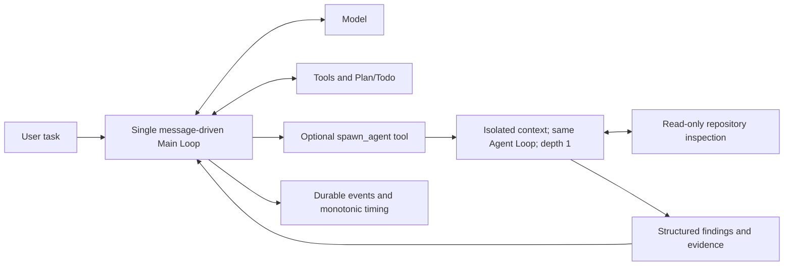

# Bounded plan-idle reminders before or after a patch

Status: dev14 candidate FAILED. Both reminders exercised, no correctness improvement, higher latency/cost. KEEP V0.2; no merge/release. Candidate runtime reverted to the dev13 source state; frozen dev14 commit remains in branch history.

The dev12 C17 run wrote a patch before the first reminder and therefore disabled both the first reminder and its dependent recovery reminder. Dev11 instead consumed its first reminder, reported plan progress, and later spent 14 model turns investigating a broad-test dependency while requested interfaces remained unfinished. This candidate replaces those separate conditions with one plan-idle rule, without changing the model prompt, tool set, child limits, observations, or scheduling.

After eight tool-using steps with unchanged unfinished plan statuses, emit a request-only reminder. A reported apply_patch mutation, including a partial write on a failed call, resets the idle interval instead of permanently disabling reminders. Status changes reset it; cosmetic text changes do not. At most two reminders occur per execution window; the second additionally requires more model-reported completed items than at the first reminder. No progress means no repeated reminders. Fully completed plans remain silent. Before any patch and any reminder, the original 24-step fallback still covers absent or constantly changing plans. Never schedule on the last step.

Plan state is a model report, not a correctness or workspace mutation signal. Shell writes are not parsed or inferred. Plan replacement can change the completed count; the hard cap still bounds prompting. The generic plan reminder explicitly describes this uncertainty, encourages focused checks and completion of requested interfaces, and leaves every action to Main. There is no graph, forced tool call, delegated planner, completion veto, or new detector model. The old pre-mutation text is retained only for its matching fallback. The experiment changes both eligibility and plan-specific guidance; it cannot isolate those two effects.

## Offline gate

Replayed 12 historical public trajectories against the unchanged V0.2 detector and candidate. Baseline replay reproduces every recorded reminder. Three C08 traces remain silent. Candidate opportunities: C17 V0.2 11/20, dev3 11, dev4 22/41, dev10 11, dev11 12/27, dev12 25; C13 V0.2 18, dev3 19, dev4 18. These are counterfactual opportunities, not improved model behavior. The dev12 early-patch path and dev11 later investigation are both covered. [Exact replay](plan-idle-bounded-replay.json).

## Live gate

One fresh masked C17, unchanged qwen3.8-flash low, Main 50 steps / 900s, samples 1, concurrency 1, same FeatureBench/isolation/Candidate Freeze, no Agent FAIL retry. Preserve dev13 monotonic execution offsets for future first/last tool completion measurements. Compare official behavior, remaining interfaces, reminders actually delivered and subsequent actions, final validation, tools/errors, model/child usage, and Main use of any child findings. Historical replay does not establish positive-control safety. C08/C13/holdout NOT RUN unless C17 warrants further cost.

External diagnostic and frozen run directory: D:/WorkSpace/AgentBenchKit/.agentbenchkit/experiments/nexus-plan-idle-bounded-20261010. The development branch must remain separate from main.

## Pre-freeze checks

Windows full regression: 512 passed, 10 optional Docker tests skipped. Final focused detector suite: 36 passed. Ruff, mypy (65 files), lock check and wheel build PASS. Tests cover early and partial patch writes, second-reminder progress gating, two-reminder cap, final-step silence, completed plans, request-only delivery, replay/privacy, compaction and resume. A Linux full unit suite was NOT RUN.

## Completed live result

Frozen source `b63803ffc3f74140b26418b75f1876d8a8599fa1`, wheel 0.3.0.dev14 SHA256 `9e105cc9a257b1512031c77383141ff720c6b0a26583777548ec97f8a5fc2da2`, image `sha256:1c6704cd2e5fb5d4eaa11b24ec49e3a08aa7ebcbec4ddd864e049212f631c545`. Run `20261009T173455Z-e6da9805` (UTC ID; local date 2026-10-10). Exactly one execution, no retries. Agent LIMITED at 50 steps; official FAIL, F2P 4/14 and P2P 74/74.

| C17 metric | Stable V0.2 | dev14 |
| --- | --- | --- |
| Official F2P / P2P | 4/14 / 74/74 | 4/14 / 74/74 |
| First actual write step | 11, shell | 21, shell |
| First actual write completion | 35.830s nominal wall offset, monotonic unavailable | 106.611s monotonic |
| Agent process seconds | 422.825 | 495.695 |
| Main model turns | 50 | 50 |
| Input / output tokens | 1,676,832 / 23,498 | 1,771,519 / 28,130 |
| Cached input subset | 1,252,864 | 1,302,528 |
| Model / tool wall seconds | 415.521 / 4.804 | 473.709 / 19.359 |
| Historical estimated CNY | 0.5279054 | 0.5813966 |
| apply_patch errors | 0 | 1 |
| Child calls / steps / estimated cost | N/A | 0 / 0 / 0 |

Observed latency +17.23%, estimated cost +10.13%; no reduction in model turns. All 50 usage records are complete. Cost uses the same historical formula ((input-cached)*0.8 + cached*0.1 + output*2.7)/1e6 CNY, not a current tariff or invoice. Provider cache and unseeded model variation remain confounders. The V0.2 baseline predates stronger egress isolation. Do not interpret one run as a causal significance claim.

Three-case status for this candidate: C08 NOT RUN (V0.2 PASS 21/21), C17 FAIL 4/14 (V0.2 FAIL 4/14), C13 NOT RUN (V0.2 FAIL 162/202). No holdout or full-16 expansion. Offline C08 silence does not establish a live positive-control PASS.

## What actually happened

The first reminder was scheduled after step 11 and delivered at step 12 (50.992s). Main continued reading until an unsuccessful patch at step 20, then wrote coordinate_transform.py with shell redirection at step 21 (106.611s). The step-20 patch was correctly rejected because its exact old context was absent; step 22 succeeded. Main marked survey and coordinate-transform work completed at step 23.

Step 26 added index helpers through shell. A focused check at 27 failed in merge code, followed by repeated merge investigation. The second reminder was scheduled after step 31 and delivered at step 32 (158.523s). Actual trajectory replay through the old detector produces only step 11; the candidate reproduces exactly 11/31. Thus the new branch was genuinely exercised, unlike dev12. Main read more code at 32/33 and began merge writes at 34; this temporal sequence does not prove the reminder caused that action. Merge work and failed lookups continued through step 43. There is no demonstrated reduction in repetitive exploration or earlier completion of remaining interfaces.

All six requested files were ultimately changed: coordinate_transform.py, coordinates.py, formatting.py, indexes.py, utils.py and structure/merge.py. File coverage alone did not yield correctness. Step 36 pytest failed 1/passed 1 because merge_collected was missing, while the pipeline returned shell success. Step 39 attempted a blocked PyPI download. Step 48 pytest used the nonexistent test_backand.py path and ran no tests, again under a successful tail pipeline. Step 49's edit script asserted against an incorrect class declaration before writing, then its trailing grep returned shell success. Step 50 finally wrote coordinates/formatting and checked only that xarray imported. There was no behavior check after the final edits.

The ten official failures are now seven missing CoordinateTransformIndex.should_add_coord_to_array errors in Dataset._construct_dataarray, two missing OrderedSet.update errors in Dataset._copy_listed, and one invalid module-level import of group_by_index in the generated merge helper. The first two expose dependencies reached by the added interfaces; the last is an invented/wrong dependency introduced by the generated code. These three names are absent from the original problem_statement. Their absence is not permission to ignore integration behavior, and these post-run verifier details were never sent to the agent. Earlier from_xindex absence is no longer the common entry failure, but deeper failures leave the official score unchanged.

No spawn_agent call occurred, so child context isolation and tool availability still do not establish autonomous delegation value. There is no real Main integration example to claim for this run. Existing standalone child diagnostics remain component evidence only.

## Architecture and disposition

Main remains the only workspace writer and final integrator. Child limits remain two calls, six steps, 150 seconds, 24k context, requested output at most 2048 tokens per call and a 6k-byte report. Provider output-limit compliance is not a strict billing guarantee. No scheduler or fixed graph was introduced.

Reject dev14 and withdraw the new two-reminder rule and plan-specific guidance. Restore runtime/config/tests exactly to the pre-experiment dev13 state, retaining its previously verified monotonic telemetry and the original V0.2 detector behavior. Do not replace stable V0.2 with dev13 either: the retained experimental SubAgent/tool changes still lack the required overall real-task improvement. This rollback prevents another unearned mechanism from accumulating while preserving the exact failed candidate for review. The next investigation should not assume that adding more reminders solves integration coverage.

Integrity PASS: 36 installed source hashes equal the wheel and frozen source; dependency equivalence apart from Nexus, original evaluator/ABK source identity, egress isolation, immutable inputs, one execution, official report, raw/archive evidence equality and cleanup all verified. Evidence hash `12b605bac62619ec0b85906ba622e60e1ca3f6d02959f4e281e1d36a55293d39`. All 218 timed lifecycle events contain nondecreasing monotonic offsets. Core loop ended at 493.643s; process duration 495.695s also includes outer startup/exit work. A tool completion offset is not the exact instant of an internal write.

[Audited metrics and failure evidence](plan-idle-bounded-result.json). Full frozen artifacts, public tool analysis and timing audit remain in the external experiment directory. Runtime candidate b63803f is preserved in branch history; main/origin/main remain untouched. Long-term goal remains active and unachieved.

Automatic approval initially rejected the launch over an unverified source-data boundary. Read-only checks established that the payload was the user-authorized public pydata/xarray task and isolated repository, with only temporary workspace/generated agent_home mounts and no host Nexus/user-directory mount. The same unchanged command then passed automatic review and ran once. No bypass, extra model run or Agent FAIL retry occurred.

Post-rollback verification: runtime/config/tests are byte-identical to 3ad7117 in Git diff; Windows full regression 509 passed / 10 optional Docker tests skipped, Ruff/mypy (65 files) and lock check PASS. No live process remains.
