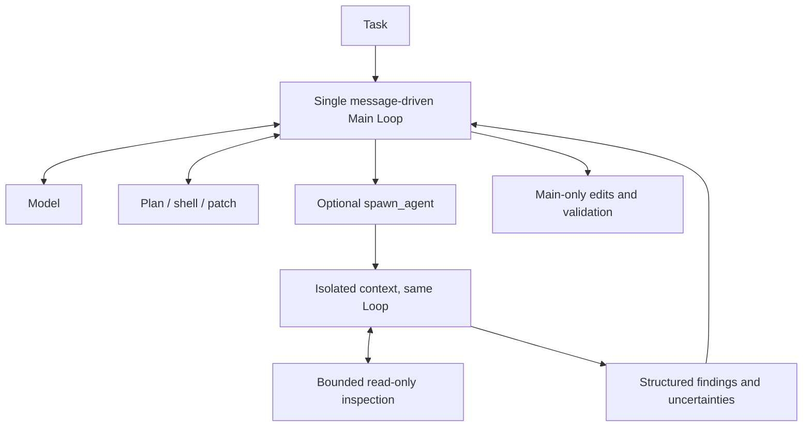

# Optional delegation in the existing bounded reminder

Status: C17 completed and audited. Candidate acceptance FAILED. KEEP V0.2; do not merge/release this candidate.

Across ten prior development/formal agent runs through dev6, Main never called the exposed spawn_agent tool. Direct component probes show a child can return bounded evidence, but contain factual errors and do not establish Main adoption or integration value.

This candidate appends a short optional delegation suggestion to the existing once-per-run pre-mutation stagnation reminder, only when spawn_agent exists in the current registry. It asks for one independent question and source-backed integration, while keeping time for implementation and checks. No new trigger, forced call, detector threshold, scheduler, graph, child budget, or persisted message is added. Main still decides when to delegate and remains the only writer.

The candidate also retains dev7 shell feedback, dev8 report guidance, and dev9 compact single-file child reads. Therefore a comparison against dev4 or V0.2 is a combined-candidate comparison, not a causal isolation of the reminder text.

Protocol: one fresh C17 prepared/masked FeatureBench task, qwen3.8-flash, low reasoning, max_steps=50, agent=900s, samples=1, concurrency=1, no Agent FAIL retry. Freeze wheel/source/config/dataset/evaluator before inference. Never inject the earlier unmasked component findings into the task. Inspect optional delegation, Main use of returned evidence, correctness, mutation/validation timing, errors and inclusive child cost. C08/C13 and holdout are not part of this run.

Tests cover availability, exactly one request-local reminder, absence from persisted messages, and no runtime-forced delegation. Existing detector tests retain their thresholds and delivery behavior.

## Completed C17 result — 2026-10-10 Asia/Shanghai

Frozen source `0748a72357b4e0b9017dcf6ec0b12a3476fbec5e` (0.3.0.dev10), branch `codex/nexus-subagent-nudge`. Run `20261009T162812Z-2fe99645` uses UTC in its ID. The exposed registry includes spawn_agent; the existing plan-idle detector fired at step 11 and the next request carried its once-only guidance at step 12. This candidate's source appends the optional delegation paragraph there. Main nevertheless completed all 50 steps without a child call. The intended adoption/integration benefit was not demonstrated.

| C17 metric | Stable V0.2 | dev10 |
| --- | --- | --- |
| Official | FAIL | FAIL |
| F2P / P2P | 4/14 / 74/74 | 4/14 / 74/74 |
| Outcome / Main turns | LIMITED / 50 | LIMITED / 50 |
| First actual write | shell step 11 / 35.830s | shell step 28 / 192.974s |
| Agent wall | 422.825s | 342.527s |
| Model / tool wall | 415.521s / 4.804s | 335.750s / 4.321s |
| Input / output tokens | 1,676,832 / 23,498 | 1,646,912 / 19,796 |
| Cached input subset | 1,252,864 | 1,184,768 |
| Historical estimated cost | CNY 0.5279054 | CNY 0.5416412 |
| Patch failures | 0 | 1 |
| Child calls / steps / cost | not available | 0 / 0 / 0 |

Agent duration fell 19.0%, while estimated cost increased 2.6% because the recorded cache mix differs. First implementation was 157.1s later. There is no correctness gain and no demonstrated reduction of search burden through delegation. Costs use the historical formula recorded in the machine-readable result, not a current price/invoice; single unseeded runs and the stronger later network isolation limit causal comparison.

The first patch at step 27 failed with patch_conflict; Main wrote coordinate_transform.py through shell at step 28. The final frozen diff changes only coordinate_transform.py, indexes.py, utils.py and structure/merge.py. It omits coordinates.py and formatting.py. All ten F2P failures are AttributeError for missing Coordinates.from_xindex. That interface is explicitly present in the task's public user message (character offset 41083); this was a missed requirement, not an absent specification.

Main imported helpers at steps 32/39, then made merge changes. Last actual mutation was shell step 49 / 336.974s. Its smoke printed one successful merge but then failed with NameError for drop_dims_from_indexers in Dataset.isel. Step 50 only searched for the missing import. Earlier smoke failures involved infix_dims and _unified_dims; the later patch caught NameError and broad Exception around fallback behavior rather than proving correct broadcasting. No final passing behavior check or final response was produced. The automatic analyzer's empty pytest/assert candidate list must not be interpreted as no validation: manual review found these inline smoke commands.

There was no child report to integrate and no Main-use case. Direct child protocol successes from prior component experiments remain separate and cannot satisfy this acceptance criterion. The compact read rendering has independent deterministic evidence-density benefits, but did not matter in a run with zero children.

## Architecture and disposition

Depth remains 1, child at most 6 turns / 150s / 24k context / requested 2048 output tokens per request, 8k tool output and 6k report bytes, at most 2 calls per Main run. No child writes, workspace ownership ambiguity, scheduler or fixed workflow graph. Compared with stable main, runtime source changes span 9 files, 387 insertions and 6 deletions, including 290 lines for SubAgent. This complexity is not justified by an overall real-task improvement yet.

Reject the optional reminder addition as a recommended capability change: it reached the intended request but did not establish the intended behavior. Preserve the frozen experiment branch and evidence for review; do not promote it because it was implemented. Stop prompt-only delegation tuning and do not spend another C08/C13/holdout run on this candidate. Required-interface coverage and implementation/validation convergence remain unresolved. Stable V0.2 is unchanged.

C08/C13 for **this dev10 candidate are NOT RUN**. Earlier full three-case results remain in [the original final assessment](v0.3-final.md) and [the observation-retention assessment](observation-retention-final.md); they must not be relabeled as dev10 results. The former rejected dev4 and the latter rejected dev6. No later evidence reverses KEEP V0.2.

## Verification and artifacts

- Windows full suite: 508 passed, 10 optional Docker tests skipped. Focused stagnation tests: 35 passed. Final changes after these tests only wrap the same guidance text across source lines.
- Final Ruff src/tests, mypy src (36 files), lock check and wheel build: PASS. A new Linux full pytest run was NOT RUN; the frozen image executed the real Linux task.
- Source/wheel equality (36 Python files), installed image dependency equivalence apart from Nexus, frozen manifest, unchanged ABK release source and FeatureBench evaluator revision, raw/archive evidence hashes, official report verdict and cleanup: PASS. One execution, no retry.
- Main/origin/main remain `b5b25b5c9eb26fe4f11fd5e10f0d42b267e8c80a`. No merge or release.

[Audited measurements and behavior review](subagent-nudge-result.json). External reproducible runner, freeze and verifier artifacts: `D:/WorkSpace/AgentBenchKit/.agentbenchkit/experiments/nexus-subagent-nudge-c17-20261010`. Evidence hash: `08b7b4c4bf1a69ea6708ee8ec46fa6f2303e76c2f00d68acfaa643fdd95aa8e5`.
