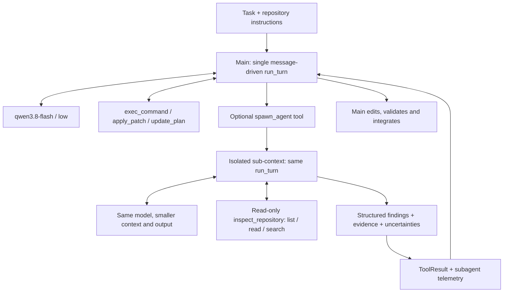

# Nexus V0.3 最终验收：FAILED — KEEP V0.2

日期：2026-10-09。开发分支：`codex/nexus-v0.3-final`。最终受测源码：`08059ea`（0.3.0.dev4）。

**不推荐 merge / release。保留稳定 V0.2。** 两轮均只有 C08 official PASS；最终 C13 超时且 F2P 从 162/202 降至 48/202，C17 未改善，C08 虽保持 PASS 但延迟增加约 84%。SubAgent 的真实价值验收也未满足。保留开发分支与全部证据供复盘，不合并 main，不发布。

本结论针对本次候选和固定实验条件；不声称多 Agent 架构本身无效，也不把三个已知开发题的单样本结果推广为统计结论。

## 1. 最终候选架构

保留单个手写 Main Loop；没有固定 Planner/Validator/Repair Graph，没有 Tool Scheduler。调用子 Agent 时 Main 等待，所有 workspace 写入由 Main 负责。架构图描述已实现的实验候选，不表示通过发布验收。

## 2. 与 V0.2 的实际差异

- **保留/恢复**：V0.2 Plan/Todo、request-only planning projection、StagnationDetector 的一次 bounded nudge；核心 Loop 仅增加少量工具遥测字段。
- **新增**：可选只读 `spawn_agent`、独立上下文和子模型遥测；通用 required-interface、模块覆盖、聚焦验证、尽早独立调查的提示。
- **修改**：补丁 schema 示例和错误恢复提示；明确任务绝对路径必须转成 workspace-relative patch header；保留 model request/TTFT/generation/usage 和 tool shell/returncode/timeout 等观测。路径权限和解析安全边界未放宽。
- **撤销 Batch1/1.1 扩展**：ProgressLedger、Validation Debt、completion interception/nudge，以及 shell purpose/scope 等额外协议复杂度。这些不是 V0.2 原有能力；现有证据未证明它们值得保留。本轮也没有单因素消融证明删掉它们带来收益。

相对稳定 V0.2 的运行时代码差异为 8 个文件、364 行新增、3 行删除，其中 SubAgent 实现 284 行。运行时代码没有题号、仓库名或 benchmark-specific 解题规则。源码相对 V0.2 的复杂度仍增加；因此不能用“代码更整洁/有子 Agent”替代效果验收。

## 3. SubAgent 设计与真实价值验收

`spawn_agent(task)` 在隔离上下文中复用 `run_turn`，继承根指令与 Main 给出的具体调查问题，不复制 Main 对话。子 Agent 自主 Model ↔ Tools，只能对限定仓库路径做 read/search/list；没有 shell、patch、MCP、再次 spawn 或写入能力。

边界：最大深度 1；每 Main run 最多 2 次（resume 的既有调用计数）；每次最多 6 child steps / 150s；context ≤24k，output ≤2048 tokens/request；单工具 observation ≤8k bytes，最终报告 ≤6k bytes。子调用计入原 900s 墙钟预算，child turns 额外分项统计，不挤占 Main 的 50-step 计数。无 workspace 多写者冲突。

结果要求 `findings` 与 `uncertainties` 数组，findings 应含 path:line 证据和实现含义。异常格式标记 unstructured；不制造发现。子事件包含 parent call ID、child session/run ID 和 depth；Main 的 replay history 只接收 ToolResult。Main RunResult 的 usage 仍只计 Main，必须另汇总 `subagent_*` 才能得到全成本。

**真实调用案例：没有。两轮六次真实执行均为 0 次 spawn / 0 child steps / 0 child tokens / 0 child cost。** 因而不存在可验证的“Main 利用了子返回结果”案例，也无证据证明减少了重复搜索、补齐接口或推动实现。最终候选三题的请求指纹已与包含 spawn 的实际 registry 重算匹配，并与去掉 spawn 的指纹区分，排除工具未注册这一解释。第二轮加强通用委派提示仍未触发调用；没有强制每题 spawn。

单元测试验证同一 Loop、上下文隔离、工具限制、次数/步数上限、超时/取消及结果回传；**它们不是真实任务价值证据**。该项验收明确 FAILED。

## 4. 正式三题对照

F2P/P2P 列为官方成功数/总数；PASS 以 official report resolved 为准，COMPLETED/LIMITED 不能代替正确性。

| 题目 | 版本 | Official | F2P | P2P | Main steps | 首次实际修改 step / time | Patch failures |
| --- | --- | --- | --- | --- | --- | --- | --- |
| C08 | v0.2 | PASS | 21/21 | 30/30 | 15 | 5 / 40.1s | 1 |
| C08 | dev4 | PASS | 21/21 | 30/30 | 18 | 5 / 62.3s | 2 |
| C17 | v0.2 | FAIL | 4/14 | 74/74 | 50 | 11 / 35.8s | 0 |
| C17 | dev4 | FAIL | 4/14 | 74/74 | 50 | 7 / 48.6s | 0 |
| C13 | v0.2 | FAIL | 162/202 | 245/245 | 50 | 9 / 25.5s | 3 |
| C13 | dev4 | FAIL | 48/202 | 245/245 | 43 completed / 44 started; timeout | 9 / 26.5s | 1 |

首次实际修改包括 shell 写入，时间取工具完成事件相对 run_started；不把首次成功 apply_patch 等同首次修改。详见 JSON 中人工复核的行为记录。

### Mutation 后验证与收敛

- C08：最终候选最后修改 step 14，step 15 的数学断言通过；可选 pyflakes 缺失，不能称 lint PASS。官方仍 PASS。首次修改和总耗时均未改善。
- C17：V0.2 第 11 步 shell 写入；最终候选第 7 步 shell 写入，但墙钟更晚。第 42 步才补 merge，第 50 步仍修改，随后同命令 smoke 报 `Dataset.assign_vars` AttributeError；管道让工具返回 ok，实际验证未通过。官方 10 个失败均指向遗漏 `Coordinates.from_xindex`，F2P 完全未改善。
- C13：V0.2 首次写 version helper 在 step 9 / 25.5s，核心 Plot 实现在 step 41 / 404.9s。最终候选首次修改 step 9 / 26.5s，但仅补 version.py；之后持续探索，43 个模型请求完成、第 44 个请求进行中触发 900s timeout。冻结补丁独立确认没有 Plot 修改；没有 pytest/assert 验证调用（import smoke 不能当正确性验证）。官方 F2P 从 162/202 降到 48/202，P2P 245/245，出现明确退化。

提前某次 mutation 不等于完成 required interfaces，也不等于最终验证成功。C17 的 read/search 未收敛到 from_xindex，C13 的核心实现时机与覆盖情况应结合官方结果读取。

## 5. 成本、延迟与完整开发历史

Agent 秒为执行进程墙钟；Model/Tool 秒为遥测累加，不包含官方 verifier、准备/归档时间。超时 C13 的 Model 秒只含 43 个已完成请求，第 44 个请求的耗时/usage 未回传，不可把这部分算成非模型开销。输入 tokens 含 cache，cache 是其子集，不能相加。

| 题目 | 版本 | Model attempts | Input | Cached subset | Output | Agent s | Model / Tool s | 估算 CNY |
| --- | --- | --- | --- | --- | --- | --- | --- | --- |
| C08 | v0.2 | 15 | 187,749 | 159,744 | 7,571 | 133.1 | 126.5 / 4.46 | 0.05882 |
| C08 | dev4 | 18 | 319,578 | 281,600 | 15,821 | 244.8 | 238.7 / 3.77 | 0.10126 |
| C17 | v0.2 | 50 | 1,676,832 | 1,252,864 | 23,498 | 422.8 | 415.5 / 4.80 | 0.52791 |
| C17 | dev4 | 50 | 1,815,858 | 1,296,384 | 24,902 | 477.3 | 461.4 / 13.27 | 0.61245 |
| C13 | v0.2 | 51 | 1,407,694 | 946,688 | 26,435 | 461.9 | 455.7 / 3.71 | 0.53485† |
| C13 | dev4 | 44 | 1,556,489 | 1,059,072 | 50,133 | 900.6 | 856.3 / 3.50 | 0.63920† |

估算沿用原正式实验价格口径：uncached input 0.8、cached input 0.1、output 2.7 CNY / million tokens；不是现价查询或账单。† 表示至少一次模型尝试未返回 usage，所列 tokens/cost 只是已上报小计，缺失部分未知。51 attempts / 50 steps 来源于既有 adapter 的传输尝试，不是重跑一个失败 Agent。

V0.2 三题已上报成本小计 ¥1.12157；dev3 ¥1.03437；dev4 ¥1.35291。两轮开发共六次 Agent 执行的已上报成本小计 **¥2.38728**，不含基础设施、官方 evaluator 和缺失 usage。

第一轮 dev3（`c77d070`）完整结果如下；不从不同版本挑每题最佳值冒充最终候选：

| 题目 | Official | F2P | Steps | Agent s | Patch failures | 估算 CNY |
| --- | --- | --- | --- | --- | --- | --- |
| C08 | PASS | 21/21 | 14 | 225.4 | 3 | 0.10036 |
| C17 | FAIL | 4/14 | 49 | 429.3 | 2 | 0.56010 |
| C13 | FAIL | 163/202 | 50 | 322.8 | 4 | 0.37391† |

dev3 C13 的核心 Plot 修改发生在 step 38 / 252.2s，最后 step 50 修改后无验证；相对 V0.2 F2P 只增加 1 个。dev4 只调整通用委派/聚焦指导和绝对路径说明，所有运行时限、工具上限和 evaluator 相同。每个 frozen candidate 每题只有一个 physical execution；没有 Agent FAIL retry。开发到两轮后停止，没有 holdout，也不再依据最终失败调参。

## 6. 仍存在的问题与解释边界

1. required-interface 覆盖提示不足以确保实现完整；C17 仍遗漏 from_xindex。
2. exploration → implementation 和末尾收敛不可靠；剩余 steps 不能稳定留给验证，Main 可在最后一步继续写代码。
3. SubAgent 可用但未被该模型策略采用；目前增加了实现维护成本，真实搜索减负收益为零证据。只读 inspect 也无法执行假设验证测试。
4. StagnationDetector 只识别 apply_patch 修改，shell 写入不进入 mutation 计数。C17 第 22 步仍收到 pre-patch guidance，实际早已 shell 修改；保留该 bounded nudge 并未解决普遍收敛。
5. shell pipeline 可掩盖上游失败；ToolResult ok 不是语义上的测试 PASS。补丁仍有 wrong-context/empty-chunk 等错误，提示强化没有彻底消除 action contract failures。
6. Main 与 child usage 的应用层聚合尚不统一；本次 child=0，不影响结果，未来应从事件完整聚合。
7. 每题单样本、两轮均为已知开发题，无 holdout 泛化证明；延迟受服务波动影响。网络隔离比早期 V0.2 样本更强，不能称完全同环境；未观察到网络需求导致本轮失败，但不能从这个样本估计因果效应。

## 7. 复现、完整性与工程检查

任务：

- C08 `mlflow__mlflow.93dab383.test_trace_correlation.53c200a6.lv1`
- C17 `pydata__xarray.97f3a746.test_coordinate_transform.6cacb660.lv1`
- C13 `mwaskom__seaborn.7001ebe7.test_plot.b645d353.lv1`

固定 qwen3.8-flash / reasoning low / Main max_steps 50 / agent timeout 900s / samples 1 / concurrency 1。使用未修改的 ABK 0.2 release 与 FeatureBench evaluator commit `8d4e347ec57546685c5a87e8676bf575db022ea6`，原 task images，Candidate Freeze 与隔离验证。新 Agent 镜像在无网络构建步骤安装 Nexus wheel，36 个运行时源码文件哈希与冻结源码一致，任务基线/其他依赖不变。Agent 网络仅允许 model proxy，GitHub/PyPI 与直接 socket 访问阻断；验证器不进入 Agent 上下文。

完整性审计 **PASS**：两轮 manifest、source/wheel、ABK release 文件哈希、raw/archive evidence_hash 一致；六个 candidate_frozen=true；每 cell 一次 execution；official report 与 verdict 一致；全部 cleanup COMPLETED。详见 [机器可读结果](v0.3-final-results.json)。

检查：Windows 全量 **504 passed / 10 optional Docker tests skipped**；dev4 提示改动后相关测试 **114 passed**；Ruff、mypy（64 source files）、uv lock --check、wheel/sdist build PASS。Windows pytest 使用新的 repo-local basetemp。Linux 子 Agent 单测 **NOT RUN**：冻结 ABK release interpreter 无 pytest；未向其安装依赖。上述离线检查不替代真实能力验收。

证据目录（不把大体积 benchmark candidate 或私密配置提交到 Git）：

- V0.2：`D:/WorkSpace/AgentBenchKit/.agentbenchkit/experiments/featurebench-16x2-restart-20261009`
- dev3：`D:/WorkSpace/AgentBenchKit/.agentbenchkit/experiments/nexus-v03-final-3case-20261009`
- dev4：`D:/WorkSpace/AgentBenchKit/.agentbenchkit/experiments/nexus-v03-final-r2-3case-20261009`

每轮包含 manifest/source-hashes、预检、runner、execution-ledger、归档轨迹、candidate、official report；dev4 额外含 comparison.json、final-integrity.json、tool-exposure-proof.json 和人工行为复核。Git 中结果 JSON 保留 run IDs、官方 report SHA256、evidence hashes 与成本分项，可定位本地原始证据。

## 8. 最终建议

**KEEP V0.2。** 不为 SubAgent 技术点发布，不合并本候选。后续若再启动，应先解决工具采用与任务接口覆盖的可测机制，再通过独立真实任务证明收益；本次冲刺到此停止。
