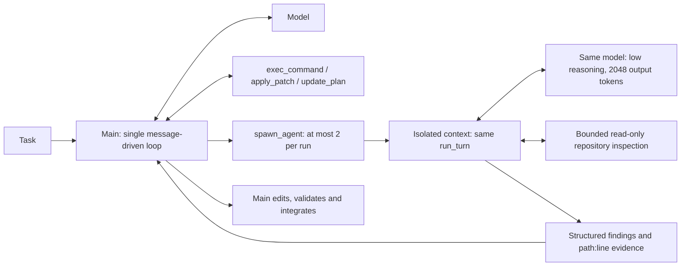

# Nexus V0.3 final sprint (experimental, not accepted)

The 2026-10-09 user request authorizes development, three known development cases,
phase commits/pushes, but no merge or release. Branch: codex/nexus-v0.3-final.
The existing 16-case diagnosis is observational evidence, not proof of intervention benefit.

## Candidate design

Restore stable V0.2 Plan/Todo and bounded one-time StagnationDetector guidance.
Remove Batch1/1.1 ProgressLedger, validation debt and completion interception: their
available three-case evidence did not establish improvement, and the completion reminder
never fired in Batch1.1. Preserve patch contract examples/recovery and provider timing,
usage, shell/returncode/timeout/truncation observations. Add general interface-coverage and
focused implementation guidance; no task IDs or benchmark-specific rules in agent code.
No scheduler, fixed graph, or automatic tests.

Child context inherits stable instructions only, plus Main's explicit narrow task, not Main
history. One depth, no child spawn/exec/apply_patch/MCP, no workspace writes. Main pauses
while the child reads; there is no concurrent workspace writer. Read/search/list is a small
capability-limited tool, not a shell allowlist or a claimed OS sandbox. Local trusted execution
still applies. Custom/remote registries do not silently inherit host filesystem capabilities.

Limits: 2 calls per run (persisted calls count across resume), 6 child model turns each,
24k context, 2048 output tokens/request, 8k bytes/tool observation, 6k bytes/final report,
150s/call. Parent retains max_steps=50; child turns are additional and explicitly reported.
Both run within the original 900s agent wall budget. Child final output is parsed as findings
and uncertainties; malformed output is labeled unstructured, not invented evidence.
No extra summarization model call. Child telemetry uses subagent_* events with parent_call_id,
child session/run IDs and depth. Child messages do not enter Main's replay history.

## Evidence plan

C08 mlflow trace correlation; C17 xarray coordinate transform; C13 seaborn Plot.
qwen3.8-flash / low / Main max_steps 50 / 900s / samples 1 / concurrency 1.
Use unchanged ABK release, official FeatureBench verifier, Candidate Freeze, network isolation.
Compare official correctness, first mutation, last validation, patch failures, tokens/latency,
child costs and whether Main used findings. Each attempt is immutable; never retry Agent FAIL
within a frozen candidate. Any changed candidate is a separately identified development run.
No holdout tuning. Recommendation depends on real results; until then KEEP V0.2.

Offline candidate checks: 504 passed / 10 optional Docker checks skipped; Ruff, mypy,
uv lock --check, wheel and sdist builds PASS. Default Windows pytest temp directory was
not writable; verified suite used a fresh project-local --basetemp.
